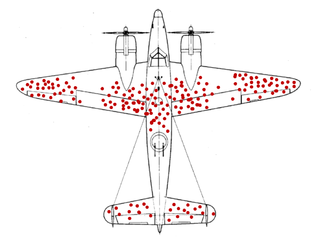

# Bias就是认知偏差

- 首先明确，偏见是必须经历的阶段；
- 其次明确，我们不应该止步于偏见。
- 偏见趋向真理则成独家之言，反之则成谬误，不可不察。

## [认知偏差(Cognitive bias)](https://en.wikipedia.org/wiki/Cognitive_bias)

认知就是在精神世界重构物质世界，重构世界的偏差就是认知偏差，即偏见。认知偏差确认无法消除，唯有无限接近而已。对个体而言，认知偏差具有积极意义，确保了个体的多样性。对族群而言，需要包容认知偏差，唯有无数个体不间断的试错才能促进族群的成长。

## 错误逻辑之一：以非必要条件因果推论

如同瞎子摸象，从片面到全面，是我们认知的发展历程。

1. [选择偏见(Selection bias)](https://en.wikipedia.org/wiki/Selection_bias) 由于采样偏差导致统计数据不能代表要分析的群体，统计分析的失真最终推导出错误的结论。短期选择偏见没有任何意义，长期选择偏见必定遵循某个法则。

2. [幸存者偏见(Survivorship bias)](https://en.wikipedia.org/wiki/Survivorship_bias) 属于长期选择偏见，仅仅考虑成功而存活的，忽略失败而消亡的，以非必要条件因果推论，最终推导出错误的结论。幸存者偏见适用于任何竞争性领域。

- 适用于军事领域
二战期间在考虑如何最大限度地减少穿越火线的轰炸机损失时，海军分析中心对从任务返回的轰炸机进行损伤评估，建议将装甲添加到受损最严重的区域。统计学家亚伯拉罕·沃尔德（Abraham Wald）提出相反意见，建议将装甲添加到没有受损的区域，因为这些地区如果被击中将导致轰炸机无法返回。这是运筹学开创性事件。

- 适用于历史领域  
历史由胜利者书写，绝大多数信息都已丢失 - 事实已经被破坏，关键事件背后的实际原因和动机，已经淹没在时间洪流中。历史总被一遍又一遍地修剪，以至于剩下的东西，或者我们认为是历史的东西，只不过是现实的影子。
- 适用于金融证券  
失败公司已不复存在而被排除在数据之外，仅仅幸存公司的数据往往导致研究结果偏高。  
- 适用于耐用品制造  
在市政建设中，新建筑不断被建造，旧建筑不断被拆除。经历不断更新、翻新或革命的过程，只有质量最可靠、外形最美丽、功能最实用、结构最完善的建筑物，才能幸存下来。绝大多数旧建筑从公众视野消除了，这造成公众错误的认知，过去的建筑质量更加可靠、外形更加美丽、功能更加实用、结构更加完善。  
机器、设备等耐用商品经历类似的过程，所有在过去失败的产品都不再为一般人群所见，因为它们已被废弃、报废、回收或以其他方式处置，只有过去最好的产品才能存活到今天。  
实际上自20世纪以来，材料、技术、制造和测试方面的能力和工艺都得到了极大的发展，往往迫于生产成本和时间的压力，寻求制造捷径导致不太耐用的产品。
- 适用于竞争职业（赢者通吃）  
无论是影视明星、运动员、程序员、音乐家、科学家，还是创业者，大众媒体经常会讲述坚定追求梦想并战胜困难的个人传奇。很少有人关注那些可能同样熟练和坚定但却未能找到成功的人，因为他们无法控制的因素或随机事件。绝大多数的失败都不为公众所知，这造成公众错误的认知，任何人如果有能力并付出努力就能获得伟大的成就。

## 错误逻辑之一：逻辑倒置，由果寻因

1. [确认偏见(Confirmation bias)](https://en.wikipedia.org/wiki/Confirmation_bias) 是以个体信念或假设的方式搜索、解释、支持和回忆信息的倾向，同时对与之相矛盾的信息给予不成比例的关注。  
确认偏见容易导致信仰，并且可以在相反证据面前维持或加强信念。在政治和组织背景下发现了由于这些偏见而导致的糟糕决策。

2. [锚点(Anchoring)](https://en.wikipedia.org/wiki/Anchoring)
在做出决策时，个体过于依赖所提供的初始信息。  
例如，在谈判之前或开始时设定的二手车的初始价格为随后的所有讨论设定了一个任意的焦点。低于锚点的谈判中讨论的价格似乎是合理的，即使所述价格仍然相对高于汽车的实际市场价格，也可能对买方来说甚至更便宜。

3. [事后偏见(Hindsight bias)](https://en.wikipedia.org/wiki/Hindsight_bias) 即后见之明。首先事后偏见容易扭曲我们对事件发生前所知的记忆，其次事后偏见导致我们在预测未来事件结果方面过度自信。  
事后偏见经常出现在历史学家描述战斗结果的著作中、在医生回忆临床试验的记录中、在司法系统个人根据所谓的事故可预测性来确定责任的描述中。  
事后偏见受到负面结果严重程度的影响。在医疗事故诉讼中发现：负面结果越严重，事后偏见就越显着。

4. [知识诅咒(Curse of knowledge)](https://en.wikipedia.org/wiki/Curse_of_knowledge) 当个体与其他个体交流时，会在不知不觉中假设其他个体有理解的知识背景。  
一位才华横溢的教授可能不记得年轻学生在学习新科目时遇到的困难。这种知识诅咒解释了根据对教师最有利的东西来思考学生学习的风险，而不是学生们已经验证过的东西。  
价格将反映不知情买家无法观察到的特征（如质量），高质量的商品将被定价过高，利润最大化的商品需要平衡质量与价格。
