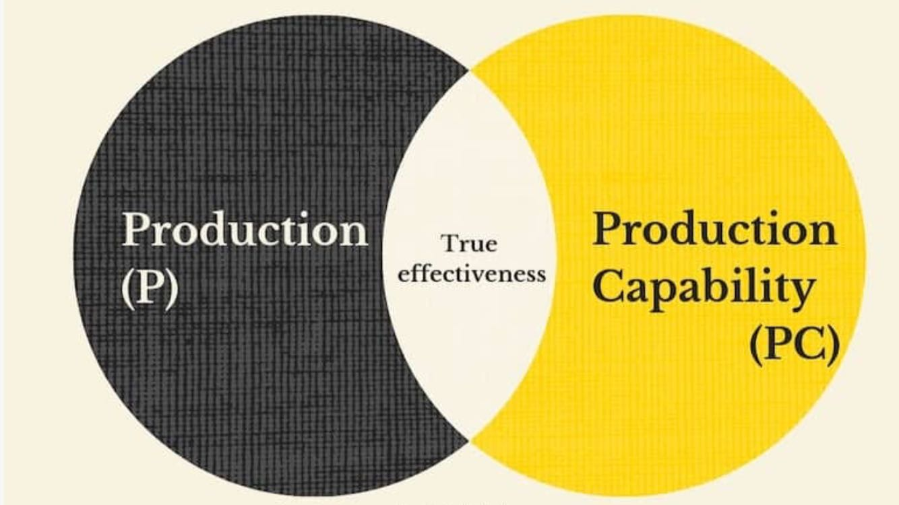

# [The 7 Habits of Highly Effective People]

The 7 Habits of Highly Effective People, first published in 1989, is a business and self-help book written by Stephen Covey.

## The P/PC Balance

You can be efficient with things but not with people. With people you must be effective. True effectiveness is when you can attain a balance between P and Pc (between Production and Production Capability).

Do you remember Aesop’s fable of the goose and the golden egg?

One morning a farmer finds a glittering, golden-colored egg sitting beneath his goose. At first he thinks it is a prank, but he decides to have the egg appraised just in case.  
To the farmer’s amazement, the egg is pure gold!
And each morning his prize goose continues laying the valuable eggs.  
The farmer becomes extremely wealthy. But he also becomes greedy and impatient.  
One day in his frustration the farmer kills the goose, hoping to get all of the golden eggs at once from inside the goose.  
As we all know, the farmer finds nothing. And now, he has neither a goose nor any more golden eggs.

Aesops fable shows us that true effectiveness is a function of two things: What is produced (golden eggs) and the producing asset or capacity to produce (the goose).

The P/PC balance is all about balancing the two extremes:

- Extreme #1: Focusing only on golden eggs or producing short-term results. In the long-run, you lose your ability to produce results at all because you never nurture your production capacity.
- Extreme #2: Focusing only on the goose or production capacity. Without short-term results, you will not survive (literally or figuratively) to see the long-term payoff.

The goal is to balance these two extremes. Because being only in one of the two extremes is disastorous. Effectiveness lies in the balance between P and PC. It balances short term with long term.

## Paradigm and paradigm shift

Covey introduces the concept of paradigm shift and helps the reader understand that different perspectives exist, i.e. that two people can see the same thing and yet differ with each other.

Paradigms are the mental maps that we use to describe the world around us. They are the lens that each of us uses to understand everyone and everything. The key of a paradigm isn't as much in the true nature of a thing as much as our perception of the thing. They also deal with our views and our mental perspective due to to the actions done around us.

A pattern shift is the change in one's perspective concerning the way we perceive things. They are two different things: changing the way we see things around us and changing the things around us. Covey describes how once he was frustrated in the subway to see the very bad behavior of a man's children, but when he found out that they were coming from the hospital where the mother had just died an hour before, his perspective changed completely.

The key to maintaining a good paradigm(s) is to keep an open mind, be optimistic and realize that however much we see. There is always more to the picture than just the painting, depending on the audience.

Kuhn presented his notion of a paradigm shift in his influential book The Structure of Scientific Revolutions (1962).  
Kuhn used the duck-rabbit optical illusion, made famous by Wittgenstein, to demonstrate the way in which a paradigm shift could cause one to see the same information in an entirely different way.

## The Character/Personality Ethic

- The Character Ethic: aligning one's values with so-called universal and timeless principles.
  - Principles as external natural laws, while values remain internal and subjective.
  - Our values govern our behavior, while principles ultimately determine the consequences.
- The Personality Ethic
  - Personality refers to the combination of qualities, attitude and behaviour, that makes a person distinct from others.Character refers to a set of moral and mental qualities and beliefs, that makes a person different from others.
  - While personality is easier to spot, it’s largely static and slow to evolve. Character, on the other hand, takes longer to discern but is easier to change. That’s because character is shaped by beliefs, and with enough effort and motivation, changing one’s perspective and view of the world can lead to a shift in one’s character.

## The Abundance/Scarcity Mindset

- The Abundance mindset: a concept in which a person believes there are enough resources and successes to share with others.
  - Individuals having an abundance mentality reject the notion of zero-sum games and are able to celebrate the success of others, rather than feel threatened by them.
  - The author contends that the abundance mentality arises from having a high self-worth and security, and leads to the sharing of profits, recognition and responsibility. Similarly, organizations may also apply an abundance mentality when doing business.
- The Scarcity Mindset (i.e., destructive and unnecessary competition), which is founded on the idea that if someone else wins or is successful in a situation, it means you lose, because you are not considering the possibility of all parties "winning" in some way or another in a given situation (see zero-sum game).

## The Maturity Continuum

Covey also introduces the Maturity Continuum. These are three successive stages of increasing maturity: dependence, independence, and interdependence.

- Dependence means you need others to get what you need. All of us began life as an infant, depending on others for nurturing and sustenance. I may be intellectually dependent on other people's thinking; I may be emotionally dependent on other people's affirmation and validation of me. Dependence is the attitude of "you": you take care of me... or you don't come through and I blame you for the result.
- Independence means you are pretty much free from the external influence and support of others. ... Independence is the attitude of "I". ... It is the avowed goal of many individuals, and also many social movements, to enthrone independence as the highest level of achievement, but it is not the ultimate goal in effective living. There is a far more mature and more advanced level.
- The third and highest level in the Maturity Continuum is interdependence. ... We live in an interdependent reality. Interdependence is essential for good leaders; good team players; a successful marriage or family life; in organizations. Interdependence is the attitude of "we": we can co-operate; we can be a team; we can combine our talents.

## Independence

The first three habits surround moving from dependence to independence (i.e., self-mastery).

Covey calls them the “habits of private victory”.

Seek to Order Yourself First, Before You Seek to Order the World.

### 1. Be Proactive, Not Reactive

For the Stoics, life was governed by a Dichotomy of Control. There are things you have no control over (Circle of Concern), and things you have some or complete control over (Circle of Influence). To live a good, tranquil, and flourishing life, the Stoic adherent strives to accept the reality of the former, while focusing his attention on the latter.

- “Between stimulus and response there is a space. In that space is our power to choose our response,” wrote Frankl in his seminal book, Man’s Search for Meaning.
- Recognize your Circle of Influence and Circle of Concern.

- Don't sit and wait in a reactive mode, waiting for problems to happen (Circle of Concern) before taking action.
- When you focus on your Circle of Concern, your Circle of Influence shrinks.

When we focus on things over which we don’t have any control, it stresses us out. A bit of stress during uncertain times can act as a positive way to prepare your mind and body for performance. But if you’re stressed out about uncertainty all the time, then not-so-good changes start to happen in your brain that create a vicious cycle of reactive anxiety. Chronic stress can cause your amygdala — the alarm system of your brain — to get larger, which in turn causes you to be more sensitive and reactive to your environment, making you more vulnerable to anxiety, anger, and fear. What’s more, chronic stress can blunt executive function, which makes it harder for you to accurately judge between actual and phony threats. To top it off, chronic stress blunts dopamine production, which our brains need to stay motivated to take action.

So in a literal way, focusing on your Circle of Concern causes it to expand and your Circle of Influence to shrink. The stress that comes from spending your energy and attention on your Circle of Concern primes your brain to see more problems than solutions, reduces your ability to figure out what is and isn’t in your control, and blunts motivation to take action on the things you do have influence over. It’s a vicious cycle.

- When you focus on your Circle of Influence, it expands.
- Focus your responses and initiates on the center of your influence and constantly work to expand it.

### 2. Begin With the End in Mind

If habit 1 advises changing your life to act and be proactive, habit 2 advises that you are the programmer! Grow and stay humble.

The end product isn’t as important as the process. As Covey explains, “writing a mission statement changes you because it forces you to think through your priorities deeply, carefully, and to align your behavior with your beliefs.”

So as you work through the steps outlined below, don’t get discouraged if you think it’s taking too long or isn’t going exactly how you wanted. In those moments when you feel like giving up, just focus on the process. Remember, the important thing is that you’re intentionally thinking about what it means to live the good life. This is a lifelong, internal discussion you’ll be having with yourself.

#### Résumé Virtues Vs. Eulogy Virtues

Writer David Brooks insightfully observes that there are two types of virtues: résumé virtues and eulogy virtues. In [The Road to Character], he explains the difference between them:

“The résumé virtues are the ones you list on your résumé, the skills that you bring to the job market and that contribute to external success. The eulogy virtues are deeper. They’re the virtues that get talked about at your funeral, the ones that exist at the core of your being—whether you are kind, brave, honest or faithful; what kind of relationships you formed.”

#### Living Life by Your Own Script: Writing Your Personal Constitution

Scripts are default goals and values handed to us by our social system — they arise from family, peers, school, advertisements, pop culture, and more. Everywhere we look there are people or organizations trying to influence us on how we should live and what we should value. These scripts are what causes us to “should on ourselves” and to participate in status competitions that deep down we don’t even care about. It’s what leads us to accomplish a lot, but feel like we’ve lived a life devoid of significance.

Here’s an example of a script that most of us have experienced: You need to get good grades in school.

Why? Well, we’re going to say it’s so we learn things and become better humans, but we know the real reason we want to get good grades is so we can get into a good college. And you get into a good college so you can get a good job that pays well and has health insurance and a 401K so you can buy a house and a car and take nice vacations with your family.

Those goals aren’t “bad,” but you’ve probably adopted them mindlessly, and you’ll end up pursuing them merely as things to knock off on a checklist, without thought as to whether they’re what you want, and what difference they’ll make in your character — in who you want to be. Your “why” for getting good grades covers the attainment of externalities, but has no deeper purpose, no connection to your inner world. Consequently, school isn’t very satisfying, and even if your success with it leads to a good job, and a nice family, and a house in the burbs, none of those things will feel particularly fulfilling either.

### 3. Put first things first

- Time Management Matrix: The 4 Quadrants
  - Quadrant I. Urgent and important (Do) : important deadlines and crises
  - Quadrant II. Not urgent but important (Plan) : long-term development
  - Quadrant III. Urgent but not important (Delegate) : distractions with deadlines
  - Quadrant IV. Not urgent and not important (Eliminate): frivolous distractions

If habit 2 advises that you are the programmer, habit 3 advises: write the program, become a leader! Keep personal integrity: what you say vs what you do.

## Interdependence

The next three habits are intended to help achieve interdependence.

Covey calls them the “habits of public victory”. The Public Habits Are “Unsexy,” But Critical. The reality is that our success in life isn’t purely an individual effort. So while personal initiative is necessary for success, it’s not sufficient. Our relationships (and a bit of luck) are the other critical part of the equation.

### 4. Think Win/Win

Covey believes that the Win/Win dynamic is the one we should strive for most, since it’s the only one in which you get what you want and you strengthen the long-term health of a relationship.

- How Seeking Win/Win Relationships Develops Your Maturity?
  - Develops your humility.
  - Recognizes the full humanity of others.
  - Requires a long-term perspective.
  - Requires becoming assertive.
  - Offers a grown-up challenge.

### 5. Seek first to understand, then to be understood

All of us gaze out at the world through the eyeholes of our own personal perspective — a filter so fixed and all-pervasive that we hardly realize it exists.

Use empathetic listening to genuinely understand a person, which compels them to reciprocate the listening and take an open mind to be influenced by you. This creates an atmosphere of caring, and positive problem-solving.

The order is important: ethos, pathos, logos -- your character, and your relationships, and then the logic of your presentation.

### 6. Synergize

Combine the strengths of people through positive teamwork, so as to achieve goals that no one could have done alone.

## Continual improvement

The final habit is that of continuous improvement in both the personal and interpersonal spheres of influence.

### 7. Sharpen the Saw

- Sharpening the Saw is about taking the time to renew and refresh the four dimensions of our natures (physical, spiritual, mental, and social/emotional) so that we’re more effective in our life’s work.
  - It’s about regularly investing in ourselves so that we can reap dividends on a continual basis.
  - It means  working smarter, not harder.
- Sharpening the Saw is what 21st-century lifestyle bloggers would call “self-care,” and while that term has become overused and annoying, there’s really something to it.

---

[The 7 Habits of Highly Effective People]:https://en.wikipedia.org/wiki/The_7_Habits_of_Highly_Effective_People

[The Road to Character]:https://en.wikipedia.org/wiki/The_Road_to_Character
