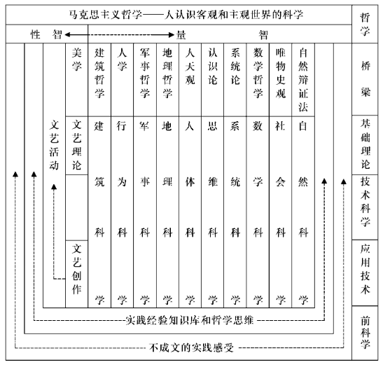

# Notes

- Reading is a process of knowing oneself and the world.
- Follow own heart and spread the love.
- Accumulate and build own knowledge tree.
- Learning, personal growth, making friends and sharing the things your love.

# Comprehensive Development of Modern S&T

# Versatile Personal Education