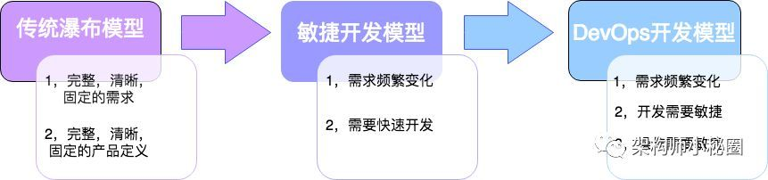

# DevOps

- “DevOps is a human problem” -- Patrick Debois started DevOpsDays in Ghent, Belgium in 2009
  - Development
  - Operations
  - QA(Quality Assurance)

## SDLC (Software Development Life Cycle / Systems Development Life Cycle)

## CALMS

- Culture
  - Focus on people
  - Embrace change and experimentation
- Automation
  - Continuous delivery
  - Infrastructure as code
- Lean
  - Focus on producing value for the end user
  - Small batch sizes
- Measurement
  - Measure everything
  - Show the improvement
- Sharing
  - Open information sharing
  - Collaboration and communication

## History Will Guide The Future

