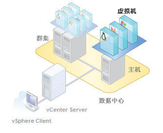

# Hardware Virtualization

## Hypervisor (Virtual Machine management software)

>VMware在Hypervisor领域处于垄断地位  

```ps
                                        +-----+-----+-----+-----+-----+
                                        |App A|App B|App C|App D|App E|
+-----+-----+-----+-----+-----+         +-----+-----+-----+-----+-----+
|App A|App B|App C|App D|App E|         |Guest|Guest|Guest|Guest|Guest|
+-----+-----+-----+-----+-----+         |OS A |OS B |OS C |OS D |OS E |
|Guest|Guest|Guest|Guest|Guest|         +-----+-----+-----+-----+-----+
|OS A |OS B |OS C |OS D |OS E |         |         Hypervisor          |
+-----+-----+-----+-----+-----+         +-----------------------------+
|         Hypervisor          |         |          Host OS            |
+-----------------------------+         +-----------------------------+
|          Hardware           |         |          Hardware           |
+-----------------------------+         +-----------------------------+
            Type I                                  Type Ⅱ
```

- Type I
  - VMware ESXi (operating system base on Linux core)
  - Xen in Linux
  - Hyper-V in Windows
- Type Ⅱ
  - VMware Workstation
  - Virtual Box

## VSphere (VMware virtualization platform)



>ESXI就是一个宿主机，可以创建多个虚拟机  
>  
>多台ESXI主机组成集群  
>  
>多个集群组成一个数据中心  
>  
>Vcenter既可以管理集群，也可以管理数据中心  

## KVM (Kernel-based Virtual Machine)

>Linux从2.6.20开始，就从内核支持虚拟化，可以理解为内核就是Hypervisor的一部分，配合Qemu实现完整的Hypervisor功能。

## Containerization

>所有的虚拟机使用同一个操作系统内核。

```ps
+-----+-----+-----+-----+-----+
|App A|App B|App C|App D|App E|
+-----+-----+-----+-----+-----+
|Guest|Guest|Guest|Guest|Guest|           +-----+-----+-----+-----+-----+
|OS A |OS B |OS C |OS D |OS E |           |App A|App B|App C|App D|App E|
+-----+-----+-----+-----+-----+           +-----+-----+-----+-----+-----+
|         Hypervisor          |           |      Container Engine       |
+-----------------------------+           +-----------------------------+
|          Host OS            |           |          Host OS            |
+-----------------------------+           +-----------------------------+
|          Hardware           |           |          Hardware           |
+-----------------------------+           +-----------------------------+
      Type II Hypervisor                          Containerization
```

- Docker (originate from LXC)
- Linux Containers
  - LXC
  - LXD
  - CGManager
- Windows Server Containers

## Kubernetes（K8s）

>容器的集群管理：一个或多个实现某种业务的容器，组成一个Pod，然后对这些Pods进行监控和管理。
