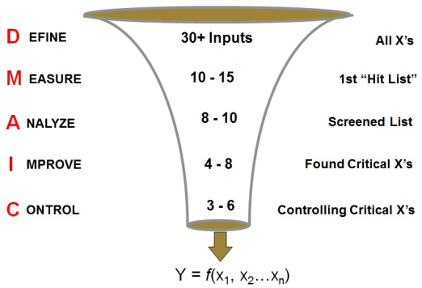

# DMAIC: Process Improvement

Process Improvement is an effort to identify high priority problems in business processes and to train teams to tackle those problems.

The methodology used is called DMAIC. It is an acronym for Define-Measure-Analyze-Improve-Control.

- In the Define phase, the project is defined.
- In Measure phase, data is collected, Measurement System is validated and current performance is identified.
- In Analyze phase, root causes are identified.
- In Improve phase, solutions are created and implemented.
- In Control phase, new performance is sustained.

## Focus the Causes (X) and NOT the Result (Y)

- Any given problem follows a Pareto principle which states that 80% of the problems are caused due to 20% of the root-causes.
  - `Y` is outcome(s) or result(s) you desire and need from a process. This is a dependent factor and it depends on the X’s.
  - `X` represents the input factors that could result in Y. There could be multiple X’s. These are independent factors.
  - `Ɛ` represents the presence of error, or uncertainty surrounding how accurately the X’s are transformed to create the outcome.
