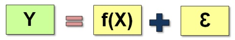

# [6σ]

`Mean` is the arithmetic average of a process data set.

`Central tendency` is the tendency of data to be around this mean.

`Standard Deviation` (also known as `Sigma` or `σ`) determines the spread around this mean/central tendency.

- Lower Specification Limit (LSL)
- Upper Specification Limit (USL)

- The more number of standard deviations between process average and acceptable process limits fits, the less likely that the process performs beyond the acceptable process limits, and it causes a defect.
  - This is the reason why a 6σ (Six Sigma) process performs better than 1σ, 2σ, 3σ, 4σ, 5σ processes.
  - the practitioners gained the belief that a 6σ process is good enough to be reliable in almost all major situations except some systems whose defects can cause unrepairable consequences.

## Focus the Causes (X) and NOT the Result (Y)

- Any given problem follows a Pareto principle which states that 80% of the problems are caused due to 20% of the root-causes.
  - `Y` is outcome(s) or result(s) you desire and need from a process. This is a dependent factor and it depends on the X’s.
  - `X` represents the input factors that could result in Y. There could be multiple X’s. These are independent factors.
  - `Ɛ` represents the presence of error, or uncertainty surrounding how accurately the X’s are transformed to create the outcome.

## Process Improvement (DMAIC)

Process Improvement is an effort to identify high priority problems in business processes and to train teams to tackle those problems.

The methodology used is called DMAIC. It is an acronym for Define-Measure-Analyze-Improve-Control.

- In the Define phase, the project is defined.
- In Measure phase, data is collected, Measurement System is validated and current performance is identified.
- In Analyze phase, root causes are identified.
- In Improve phase, solutions are created and implemented.
- In Control phase, new performance is sustained.

---

[6σ]:https://www.sixsigma-institute.org/What_Is_Sigma_And_Why_Is_It_Six_Sigma.php
