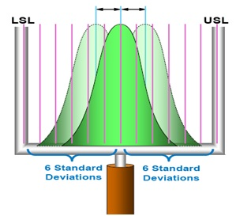
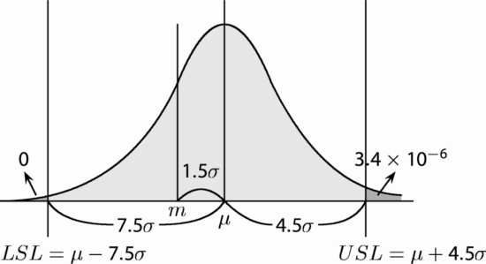
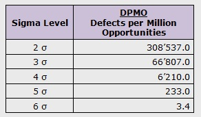

# [6σ]

## `6σ` in Statistics Category

`Mean` is the arithmetic average of a process data set.

`Central tendency` is the tendency of data to be around this mean.

`Standard Deviation` (also known as `Sigma` or `σ`) determines the spread around this mean/central tendency.

- Lower Specification Limit (LSL)
- Upper Specification Limit (USL)

P（μ-7.5σ＜x＜μ+4.5σ｜x~N（μ, σ2）) ＝0.9999966

- The more number of standard deviations between process average and acceptable process limits fits, the less likely that the process performs beyond the acceptable process limits, and it causes a defect.
  - This is the reason why a 6σ (Six Sigma) process performs better than 1σ, 2σ, 3σ, 4σ, 5σ processes.
  - the practitioners gained the belief that a 6σ process is good enough to be reliable in almost all major situations except some systems whose defects can cause unrepairable consequences.

## `6σ` in Management Category

- “In God we trust. Otherwise, Show me data.”
  - Least error ( DPMO = 3.4ppm )
  - Data-driven
  - Y = f(x) + E
- A Tool for Better Business
  - Start and end are customer-oriented
  - DMAIC ( Define-Measure-Analyze-Improve-Control )
  - Suitable for complex systems, not simple systems
  - A tactical tool, not a strategic tool

### History: Quality Movement

- [PDCA] from the 1950s
  - PDCA (plan–do–check–act) is an iterative four-step management method used in business for the control and continuous improvement of processes and products.
  - Another version of this PDCA cycle is OPDCA.
    - The added "O" stands for observation or as some versions say: "Observe the current condition."
    - This emphasis on observation and current condition has currency with the literature on lean manufacturing and the Toyota Production System.
  - It is also known as the Deming cycle, the Shewhart cycle, the control cycle.
  - PDCA was made popular by W. Edwards Deming.
    - Later in Deming's career, he modified PDCA to "Plan, Do, Study, Act" (PDSA) because he felt that "check" emphasized inspection over analysis.
- TQC (Total Quality Control) from the 1960s
  - TQC was made popular by Armand Vallin Feigenbaum.
- [TQM] from the 1980s

---

[6σ]:https://www.sixsigma-institute.org/What_Is_Sigma_And_Why_Is_It_Six_Sigma.php

[PDCA]:https://en.wikipedia.org/wiki/PDCA

[TQM]:https://en.wikipedia.org/wiki/Total_quality_management

