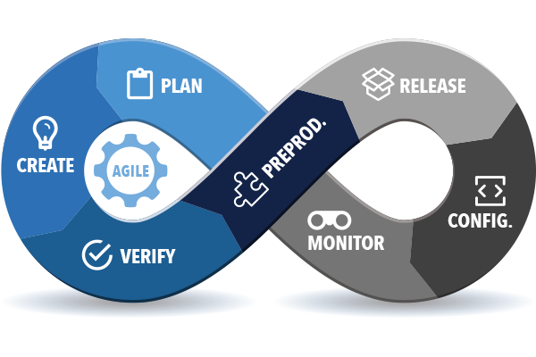
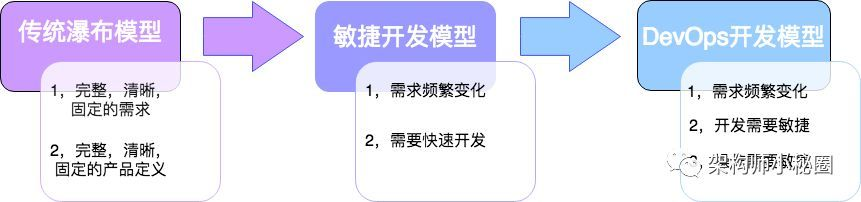

# DevOps

- “DevOps is a human problem” -- Patrick Debois started DevOpsDays in Ghent, Belgium in 2009
  - Development
  - Operations
  - QA(Quality Assurance)

## SDLC (Software Development Life Cycle / Systems Development Life Cycle)

## CALMS

- Culture
  - People and process first (If you don’t have culture, all automation attempts will be fruitless)
  - Embrace change and experimentation
- Automation
  - Continuous delivery infrastructure as code
  - Tools for release management, provisioning, configuration management, systems integration, monitoring and control, and orchestration become important pieces in building a Devops fabric
- Lean
  - Focus on producing value for the end user
  - Small batch sizes
- Measurement
  - Measure everything (If you can’t measure, you can’t improve)
  - Show the improvement
- Sharing
  - Open information sharing
  - Collaboration and communication
  - Creating a culture where people share ideas and problems is critical

## History Will Guide The Future

