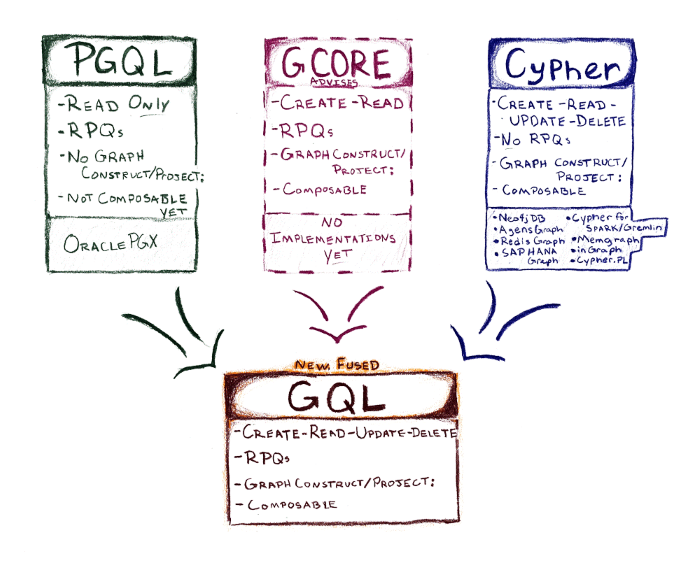

# [Graph Query Language]

- Cypher started out in Neo4j’s graph database in 2011.
  - openCypher is now used in four other commercial products.
- PGQL comes from Oracle PGX (first appearing in 2016)
- G-CORE is a research language, described in a SIGMOD ‘18 paper written by several academics, as well as language designers from four industry vendors, working in the LDBC Query Language task force.
  - Both languages have also been used in research projects.

---

[Graph Query Language]:https://gql.today/
