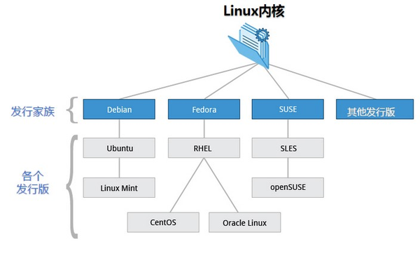

# Linux

## [The Linux Kernel] (non-commercial)

- mainline (the degree of attention)
- stable (the degree of mastery)
- longterm (the degree of understanding)

## [GNU]

- GNU's Not Unix
- [Free Software] (non-commercial or commercial)
  - Free software means the users have the freedom to run, copy, distribute, study, change and improve the software
  - Free software is a matter of liberty, not price. To understand the concept, you should think of “free” as in “free speech”, not as in “free beer”
- [Common Misunderstandings of “Free Software” and “Open Source”]

### GNU/HURD (Operating System)

- The GNU Kernel (HURD)
- The GNU Software (GNU General Public License，GPL)

### GNU/Linux (Operating System)

- The Linux Kernel
- The GNU Software (GNU General Public License，GPL)

## [The Linux distribution] (non-commercial or commercial)

The Linux Kernel + Utilities = The Linux distribution (GNU/Linux distributions)

- embeddable
- server
- desktop

### Current learning Linux distribution: Fedora

---

[The Linux Kernel]:https://www.kernel.org/

[The Linux distribution]:https://mirrors.kernel.org/

[GNU]:http://www.gnu.org/

[Free Software]:http://www.gnu.org/philosophy/free-sw.html

[Common Misunderstandings of “Free Software” and “Open Source”]:http://www.gnu.org/philosophy/open-source-misses-the-point.en.html
