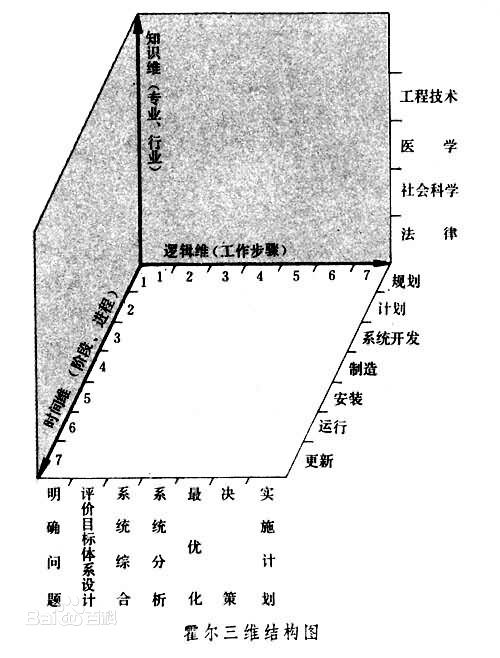

# [Systems Engineering]

>从系统观念出发，以最优化方法求得系统整体的最优的综合化的组织、管理、技术和方法的总称。[钱学森]教授在1978年指出：“‘系统工程’是组织管理‘系统’的规划、研究、设计、制造、试验和使用的科学方法，是一种对所有‘系统’都具有普遍意义的科学方法。”(《论系统工程》，1982年)

## Hard System Methodology

>美国系统工程专家霍尔(A·D·Hall)于1969年提出的一种系统工程方法论。

>一、逻辑维(思维过程)。在使用系统工程方法解决问题时，可按下述七个步骤进行：(一)提出问题;(二)选择目标;(三)系统综合;(四)系统分析;(五)选择解决问题的最佳方案;(六)决策;(七)实施计划。  
>  
>二、时间维(工作阶段)。对一个具体工程，从规划到更新，全部程序分为：(一)规划制定阶段，指调研、程序设计等;(二)初步设计阶段，即具体计划阶段;(三)研制阶段，即系统开发阶段;(四)生产阶段;(五)安装阶段;(六)运行阶段;(七)更新阶段。  
>  
>三、知识维(专业学科知识)。系统工程除有某些共性知识外，还涉及各种专业知识，如工程、医药、建筑、商业、法律、管理、社会科学和艺术等等，这些专业知识称为知识维。  

## Soft Systems Methodology

- The Soft Systems Methodology (SSM) from Peter Checkland is a qualitative technique that can be used for applying Systems Thinking to non-systemic situations.
- It is a way of dealing with problem situations in which there is a high social, political and human activity component.
- This distinquishes SSM from other methodoloqies which deal with HARD problems that are often more technology-oriented.

## Steps in SSM

### 1. Investigate

- Non-systemic situations.

### 2. Rich Pictures

- Express the unstructured problems.
  - Data flow diagrams
  - class models

### 3. Root Definition

- Customer
  - Anyone who can benefit from the system.
- Actor
  - The actors transform inputs into outputs and they perform the activities defined in the system.
- Transformation Process
  - This is shown as the conversion of inputs to outouts.
- Weltanschauung
  - This world view makes the transformation process meaningful in context.
- Owner
  - Every system has some proprietor who has the power to start up and shut down the system (power of veto).
- Environmental Constraints
  - These are external elements that must be considered.
  - These constraints include organizational policies as well as legal and ethical matters.

### 4. Conceptual models

- Formal system concept.
- Other system thinking.

### 5. Comparison of 4 with 2

### 6. Feasible, desirable changes

### 7. Action to improve the problem situation

## Limitations of SSM

- SSM requires from participants to adapt to the overall approach.
- Be careful not to narrow the scope of the investigation too early.
- It is difficult to assemble the richest picture, without imposing a particular structure and solution on problem situation.
- People have difficulties to interpret the world in the loose way. They often show an over-urgent desire for action

---

[Systems Engineering]:http://www.thefullwiki.org/Systems_Engineering

[钱学森]:https://baike.baidu.com/item/%E9%92%B1%E5%AD%A6%E6%A3%AE/26105
