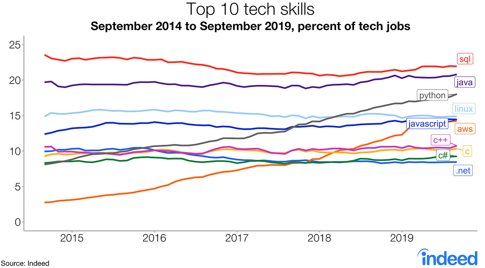

# [python]

## Why learn python



- Indeed’s researchers note that the big jumps in demand for engineers skilled in Python stems from the boom in data scientist and engineer jobs, which disproportionately use Python.
- Python came out on top in IEEE Spectrum’s analysis of top programming languages for 2019.
- Python are coming on fast, and, should trends continue, may take over the lead in the next year or two.

## Python means Python 3

Note that the Python stack still uses Python 3.7 by default.

```s
[sword@localhost ~]$ python --version
Python 3.7.5
```

## [Python 3.7.5 documentation]

---

[python]:https://www.python.org/

[Python 3.7.5 documentation]:https://docs.python.org/3.7/
