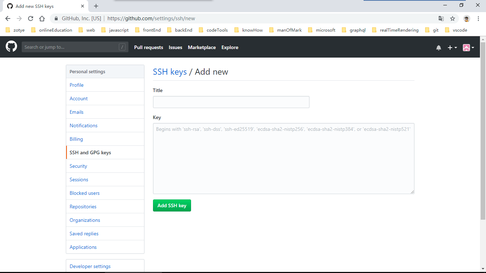

学习笔记：浏览[廖雪峰的git教程](https://www.liaoxuefeng.com/wiki/0013739516305929606dd18361248578c67b8067c8c017b000)，明白分布式版本控制系统git是非常实用的工具，[git官网深入学习](https://git-scm.com/book/zh/v2)十分有必要！

# Git的诞生

Linus于1991年创建Linux，遵循开源精神Linux的壮大依靠全世界志愿者的参与。这么多人在世界各地为Linux编写代码，那Linux的代码是如何管理的呢？

1. 在2002年以前，世界各地的志愿者把源代码文件通过diff的方式发给Linus，由Linus通过手工方式合并代码（彪悍的作风）。
2. 到2002年，Linux系统经十年发展，代码库之大让Linus很难继续通过手工方式管理；社区的弟兄们也对这种方式表达了强烈不满。于是Linus选择了版本控制系统BitKeeper。BitMover公司（BitKeeper所有者）出于人道主义精神，授权Linux社区免费。
3. 安定团结的大好局面在2005年就被打破，BitMover公司决定收回Linux社区的免费使用权。原因是Linux社区聚集的牛人（善战者无名）探索精神旺盛，开发Samba的Andrew试图破解BitKeeper底层协议的行为被发现（监控没有缺位）。
4. Linus花两周时间用C写了一个分布式版本控制系统Git！一个月之内，Linux系统的源码已经由Git管理了！牛是怎么定义的呢？大家可以体会一下。

Git迅速成为最流行的分布式版本控制系统。尤其2008年GitHub网站上线，它为开源项目免费提供Git存储（远程仓库），无数开源项目迁移至GitHub。

# 在Windows上安装Git

1. [从Git官网直接下载安装程序](https://git-scm.com/downloads)，按照默认选项安装。
2. 安装完成后，在开始菜单里点击“Git”=>“Git Bash”，蹦出命令行窗口。
3. 使用Git需要设置用户名和邮箱，在命令行输入：
```
$ git config --global user.name "Your Name"
$ git config --global user.email "email@example.com"
```
注意 : `git config`命令的`--global`参数表示全局设置，这台机器上所有的Git仓库都会使用这个配置，当然也可以对某个仓库指定不同的用户名和Email地址。

# Git专用术语

Workspace：工作区（`.git`目录除外）  
Index/Stage：索引/暂存区（不可见）  
Repository：本地仓库（工作区下`.git`目录）  
Remote：远程仓库  

# 创建工作区

1. 新建一个目录
```
$ mkdir toolDocument
$ cd toolDocument
$ pwd  
/c/Users/sword/toolDocument
```
- `mkdir <directory>` 新建文件夹
- `cd <directory>` 进入文件夹
- `pwd` 查看当前目录路径
- 请确保目录名（包括父目录）不包含中文，避免乱码问题。
2. 通过 `git init` 把当前目录变成工作区：
```
$ git init
Initialized empty Git repository in /c/Users/sword/toolDocument/.git/
```
注意：当前目录下多了一个`.git`目录，这是Git用来跟踪管理版本的本地仓库，禁止手动修改这个目录里面的文件。

# 常用查询命令汇总

1. `$ git status` 查看Git仓库当前的状态，Git仓库状态如下：
- 存在未跟踪的文件，`工作区`新建的文件或设置忽略的文件。
- 修改跟踪的文件，没有加入`暂存区`。
- 修改跟踪的文件，已加入`暂存区`，没有提交生成 `commit-id` 。
- 工作台是干净的（工作区文件与当前commit-id文件一致）。
2. `$ cat <file>` 查看文件内容。
- 注意：推荐文件带后缀，便于区分（文件与文件夹）  
3. 查看文件修改的内容（difference）。
- `$ git diff <file>`查看文件`工作区`和`暂存区`的difference。  
- `$ git diff HEAD -- <file>`查看文件`工作区`和`HEAD指针`（当前版本）的difference。
4. 查看`暂存区`提交日志。
- `$ git log`查看详细的提交日志。  
- `$ git log --pretty=oneline`查看精简的。  
- `$ git log --graph`看到分支合并图。  
- `$ git log  --abbrev-commit`精简`commit-id`。  
5. 查看`HEAD`指针裁决日志。
- `$ git reflog`  
6. 查看本地库与远程库关联。
- `$ git remote (-v | --verbose)`  
7. 查看当前目录内容。
- `$ ls`  
8. 查看不同目录。
- `$ cd /` 回到用户根目录  
- `$ cd [~]` 回到用户主目录  
- `$ cd ..` 返回上一级目录  
- `$ cd ../..` 返回上两级目录  
- `$ cd -` 返回进入此目录之前所在目录  
- `$ cd <directory>` 向前进入目录  
9. 查看当前目录路径
```
$ pwd
/c/Users/sword
```
10. 列出所有分支，当前分支前面会标一个`*`号
```
$ git branch
* dev
  master
```
# 本地仓库生成版本

1. 文件必须放置在工作区（在子目录也行）。
2. `$ git add <file>`把工作区文件添加到暂存区：
- 为了避免出错`<file>`尽可能明确路径与文件后缀。  
- Unix的哲学“没有消息就是好消息”，说明添加成功。  
- `$ git add <file>`可反复使用，添加多个文件。
3. `$ git commit -m <message>`把暂存区文件一次性提交：
```
$ git commit -m "add readme.txt"
```
- `-m <message>`输入的是本次提交的说明。  
- 生成的`commit-id`是一个SHA1计算出来的非常大的数字，用十六进制表示。  
- Git通常使用`HEAD指针`指向`master分支`。  
  
4. 注意事项：
- 所有的版本控制系统，只能跟踪文本文件的修动，Git也一样。文本文件包括.txt .md .html .json .js .css 等程序代码。非文本文件也能由版本控制系统管理，但没法跟踪文件的变化。
- 建议使用标准的UTF-8编码，中文被所有平台所支持。
- 避免使用Windows自带的记事本。它保存文件自带BOM（UTF-8 with BOM），自作聪明在每个文件开头添加了0xefbbbf（十六进制）的字符，带来很多莫名其妙的问题。

# 在`commit-id`之间穿梭（工作区恢复到指定版本）

1. `$ git reset --hard commit_id`
2. `$ git reset --hard HEAD^` 回退到当前版本上一个
3. `$ git reset --hard HEAD^^` 回退到当前版本上上一个
4. `$ git reset --hard HEAD~99` 回退到当前版本之前99个
- 注意：`HEAD指针`指向的版本就是当前版本。  

# 依据暂存区撤销修改

1. `$ git checkout -- <file>` 工作区恢复到暂存区版本。
2. `$ git reset HEAD <file>` 暂存区恢复到当前版本。

# 删除文件

1. `$ rm <file>` 工作区删掉文件（仍然被追踪）。
2. `$ git rm <file>` 暂存区删除文件（不再被追踪）。

# 远程仓库

- [GitHub](https://github.com/)：国际版，公共库免费，优秀项目多；速度较慢。
- [码云](https://gitee.com/)：国内版，公共库、五人私库免费，速度快；好项目少。

# 远程仓库身份识别（全局）

1. 创建SSH Key，通信时用于身份识别
```
$ cd ~
$ ssh-keygen -t rsa -C "youremail@example.com"
```
- 进入用户主目录。
- 创建SSH Key时设置邮件地址。
- 然后一路回车，使用默认值即可（由于这个Key并非机密用途，所以无需设置密码保存）。
- 如果一切顺利，可以在用户主目录里找到.ssh目录，里面有id_rsa和id_rsa.pub两个文件，这两个就是SSH Key的秘钥对，id_rsa是私钥（不能泄露出去），id_rsa.pub是公钥（可以放心地告诉任何人）。
2. 远程仓库部署id_rsa.pub公钥
>点击登陆 => Settings => SSH and GPG keys => New SSH key  
>  
>在Title文本框里填上任意，在Key文本框里粘贴id_rsa.pub文件的内容。  
- 只要把电脑的Key添加到GitHub就可以识别身份,GitHub允许添加多个Key（即对应多台电脑）。
- 友情提示：在GitHub上免费托管的Git仓库，任何人都可以看到，不要把敏感信息放进去。
>>GitHub远程仓库身份识别（局部屏蔽全局）  
唯一的区别：点击进入GitHub子库 => Settings => Deploy keys => Add doploy key  
# 创建远程库

1. 点击登陆 => fork（分叉GitHub中别人的远程库）
2. 点击登陆 => New repository（创建新远程库）
3. 点击登陆 => Import repository（导入旧远程库）

# 最佳实践：克隆（clone）

大家克隆同一个远程库，本地库修改，生成版本推送到远程库，实现多人协作。
```  
$ cd ~  
$ git clone <url>
```  
1. 进入用户主目录。
2. 克隆远程库，创建本地库，远程关联（默认名字 `origin`）。

# 本地库`git remote`远程关联

- `$ git remote add <name> <url>`
1. `<url>`SSH协议`ssh://user@server/project.git`或者scp式的写法`user@server/project.git`，推荐公司网络创建git用户采用公钥授权访问。  
2. `<url>`HTTPS协议`https://example.com/project.git`，网络传输速度最慢，而且每次推送都必须输入口令。  
3. `<url>`Git协议`git://`使用与SSH相同的数据传输机制，但是省去了加密和授权的开销，网络传输速度最快，监听特定端口（9418），开源首选。  
```
$ git remote add github git@github.com:xujian-jh/toolDocument.git
$ git remote add gitee git@gitee.com:xujian-jh/tool.git
```
- `$ git remote rename <old> <new>`
- `$ git remote (rm | remove) <name>`
- `$ git remote set-head <name> (-a | --auto | -d | --delete | <branch>)`
- `$ git remote [-v | --verbose] show [-n] <name>`
- `$ git remote set-branches [--add] <name> <branch>...`
- `$ git remote get-url [--push] [--all] <name>`
- `$ git remote set-url [--push] <name> <newurl> [<oldurl>]`
>1. `$ git remote set-url --delete <name> <oldurl>`  
>1. `$ git remote set-url --add <name> <newurl>`  

# 最佳实践：先拉（pull）后推（push）

1. `$ git pull [<options>] [<repository> [<refspec>…​]]`
- 如果简化操作`$ git pull` 提示`no tracking information`，用命令`$ git branch --set-upstream-to=origin/<branch> <branch>`设置默认的链接。  
- `$ git pull`相当于`$ git fetch` 跟着一个`$ git merge FETCH_HEAD`。  
- 如果发生了冲突，可以使用`$ git reset --merge`进行回退。
- `[options]` : –ff | –no-ff | –ff-only 这几个选项是说合并时是否开启fast-forward。  
2. 本地库手动修改，解决冲突，提交生成新`commit-id`。
3. `$ git push <name> <branch>`
- `$ git push -u <name> <branch> -f` 强制仅适合第一次推送（覆盖版本冲突）  
- `$ git push` 拥有默认设置后可简化操作

# 创建、合并与删除分支（例如：dev分支）

1. 创建dev分支  
`$ git checkout -b dev` 创建dev分支，然后切换到dev分支
```
$ git branch dev
$ git checkout dev
```
- `$ git checkout -b dev origin/dev`创建远程origin的dev分支到本地
2. dev分支管理开发过程
```
$ git add <file>
$ git commit -m <message>
```
- `$ git push origin dev`及时把dev分支push到远程
3. 把dev分支的工作成果合并到master分支
```
$ git checkout master
$ git merge dev
Updating d46f35e..b17d20e
Fast-forward
...
```
- `Fast-forward`模式直接把master指向dev的当前提交（删除dev分支后，会丢掉dev分支信息），没有合并信息。  
- `$ git merge --no-ff -m "merge with no-ff" dev`禁用`Fast forward`模式，不受dev分支影响，有合并信息。  
- 如果合并冲突（master分支有更新）则无法合并，必须手动解决冲突，再提交。  
- `$ git rebase`变基操作改变master分支分叉更新位置。优点是：把分叉的提交历史“整理”成一条直线，看上去更直观。缺点是：本地的分叉提交已经被修改过了。
4. 删除dev分支
```
$ git branch -d dev
Deleted branch dev (was b17d20e).
```
- 如果分支没有合并时要强行删除，需要使用大写的-D参数。  
`$ git branch -D dev`

# 分支管理策略

1. master分支应该是非常稳定的，仅用来发布新版本。
2. 干活都在dev分支上，dev分支是不稳定的。
3. 每个小伙伴都有自己的分支，时不时地往dev分支上合并。
- master分支是主分支，因此要时刻与远程同步。
- dev分支是开发分支，团队所有成员都需要在上面工作，所以也需要与远程同步。
- Bug分支只用于在本地修复bug，就没必要推到远程。
- Feature分支是否推到远程，取决于你是否和你的小伙伴合作在上面开发。
- 名字命名（人员）分支

# 最佳实践：stash“隐藏”

1. `$ git stash`“隐藏”工作现场
```
$ git stash
Saved working directory and index state WIP on dev: f52c633 add merge
```
- 仅仅“隐藏”被Git管理的文件。
- 用`$ git status`查看工作区就是干净的。
2. `$ git stash list`查看“隐藏”
```
$ git stash list
stash@{0}: WIP on dev: f52c633 add merge
```
3. `$ git stash pop`恢复的同时把stash内容也删了
- `$ git stash apply`恢复工作现场  
`$ git stash apply stash@{0}`恢复指定的stash
- `$ git stash drop`删除stash内容

# 标签（tag）

标签是master分支版本库的快照，就是指向某个commit的指针。
1. `$ git tag <tagname> <commit id>` 指定`commit id`创建新标签
- `$ git tag <tagname>` 创建新标签（默认为HEAD）
- 用-a指定标签名，-m指定说明文字：
```
$ git tag -a v0.1 -m "version 0.1 released" 1094adb
```
2. `$ git tag`查看所有标签
3. `$ git show <tagname>`查看标签信息
4. `$ git tag -d <tagname>`删除标签
5. `$ git push origin <tagname>`远程推送单个标签
- `$ git push origin --tags`远程推送所有标签
6. `$ git push origin :refs/tags/<tagname>`删除一个远程标签

# 搭建Git服务器（作为私有仓库使用）

搭建Git服务器需要准备一台运行Linux的机器，假设你已经有sudo权限的用户账号。
1. 安装git：
```
$ sudo apt-get install git
```
2. 创建一个git用户，用来运行git服务：
```
$ sudo adduser git
```
3. 创建证书登录：  
- 收集所有需要登录的用户的公钥，就是他们自己的id_rsa.pub文件，把所有公钥导入到/home/git/.ssh/authorized_keys文件里，一行一个。  
4. 初始化Git仓库
- 先选定一个目录作为Git仓库，假定是/srv/sample.git，在/srv目录下输入命令：
```
$ sudo git init --bare sample.git
```
- Git就会创建一个裸仓库，裸仓库没有工作区，因为服务器上的Git仓库纯粹是为了共享，所以不让用户直接登录到服务器上去改工作区，并且服务器上的Git仓库通常都以.git结尾。  
5. 把owner改为git：
```
$ sudo chown -R git:git sample.git
```
6. 禁用shell登录：  
出于安全考虑，第二步创建的git用户不允许登录shell，这可以通过编辑/etc/passwd文件完成。  
>找到类似下面的一行：
```
git:x:1001:1001:,,,:/home/git:/bin/bash
```
>改为：
```
git:x:1001:1001:,,,:/home/git:/usr/bin/git-shell
```
>这样，git用户可以正常通过ssh使用git，但无法登录shell，因为我们为git用户指定的git-shell每次一登录就自动退出。
7. 克隆远程仓库：
```
$ git clone git@server:/srv/sample.git
Cloning into 'sample'...
warning: You appear to have cloned an empty repository.
```
在各自的电脑上克隆，剩下的推送就简单了。