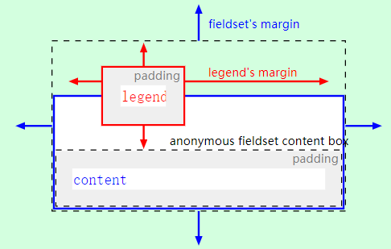

阅读笔记：HTML 渲染（Rendering）基于 CSS（也可以基于 SVG 或其他等效样式语言）呈现元素。仅仅 `hidden` 属性有效时元素没有被渲染。只是在屏幕外并不意味着元素没有被渲染。[HTML
Living Standard](https://html.spec.whatwg.org/multipage/rendering.html#non-replaced-elements) 使用 CSS 术语表示 HTML 元素在用户代理级别的预期体验。

# Non-replaced elements

1. Hidden elements
```
@namespace url(http://www.w3.org/1999/xhtml);

[hidden], area, base, basefont, datalist, head, link, meta, noembed,
noframes, param, rp, script, source, style, template, track, title {
  display: none;
}

embed[hidden] { display: inline; height: 0; width: 0; } 

input[type=hidden i] { display: none !important; }

@media (scripting) {
  noscript { display: none !important; }
}
```
2. The page
```
@namespace url(http://www.w3.org/1999/xhtml);

html, body { display: block; }
```

Source|viewport 
-|-
设置 frame or iframe 宽度和高度|"scrolling"设置滚动条属性"off", "noscroll", or "no"
没有内容（没有设置视口宽度和高度）|零宽度和零高度的视口
有内容（没有设置视口宽度和高度）|适合内容宽度和高度的视口

Property|Source ( The body element's attribute )
-|-
'margin-top'| marginheight / topmargin 
'margin-right'| marginwidth / rightmargin 
'margin-bottom'| marginheight / bottommargin 
'margin-left'| marginwidth / leftmargin 

- the first attribute that exists maps to the pixel length property on the body element. 
- 如果无法成功解析 `maps to the pixel length property`，则使用默认值 8px。

Property|Source ( The body element's attribute )
-|-
'background-image'| background 
'background-color'| bgcolor 
'color'| text 

pseudo-class to the resulting color|Source ( The body element's attribute )
-|-
:link| link 
:visited| vlink 
:active | alink 

3. Flow content（流内容）
```
@namespace url(http://www.w3.org/1999/xhtml);

address, blockquote, center, dialog, div, figure, figcaption, footer, form,
header, hr, legend, listing, main, p, plaintext, pre, xmp {
  display: block;
}

blockquote, figure, listing, p, plaintext, pre, xmp {
  margin-block-start: 1em; margin-block-end: 1em;
}

blockquote, figure { margin-inline-start: 40px; margin-inline-end: 40px; }

address { font-style: italic; }
listing, plaintext, pre, xmp {
  font-family: monospace; white-space: pre;
}

dialog:not([open]) { display: none; }
dialog {
  position: absolute;
  offset-inline-start: 0; offset-inline-end: 0;
  width: fit-content;
  height: fit-content;
  margin: auto;
  border: solid;
  padding: 1em;
  background: white;
  color: black;
}
dialog::backdrop {
  background: rgba(0,0,0,0.1);
}

slot {
  display: contents;
}
```

The div element's property|value
-|-
'align'| "center" or  "middle"
'align'| "left" 
'align'| "right"
'align'| "justify"（两端对齐）

4. Phrasing content（措辞内容）
```
@namespace url(http://www.w3.org/1999/xhtml);

cite, dfn, em, i, var { font-style: italic; }
b, strong { font-weight: bolder; }
code, kbd, samp, tt { font-family: monospace; }
big { font-size: larger; }
small { font-size: smaller; }

sub { vertical-align: sub; }
sup { vertical-align: super; }
sub, sup { line-height: normal; font-size: smaller; }

ruby { display: ruby; }
rt { display: ruby-text; }

:link { color: #0000EE; }
:visited { color: #551A8B; }
:link:active, :visited:active { color: #FF0000; }
:link, :visited { text-decoration: underline; cursor: pointer; }

:focus { outline: auto; }

mark { background: yellow; color: black; } /* this color is just a suggestion and can be changed based on implementation feedback */

abbr[title], acronym[title] { text-decoration: dotted underline; }
ins, u { text-decoration: underline; }
del, s, strike { text-decoration: line-through; }

q::before { content: open-quote; }
q::after { content: close-quote; }

br { display-outside: newline; } /* this also has bidi implications */
nobr { white-space: nowrap; }
wbr { display-outside: break-opportunity; } /* this also has bidi implications */
nobr wbr { white-space: normal; }
```
- CSS ruby ​​不处理嵌套 ruby 元素或多个顺序 rt 元素

property|The initial value
-|-
'color'| "black" 
'background-color' | "transparent" 
The canvas's background | "white"


value|'font-size' keyword|Notes
-|-|-
1|'x-small'|
2|'small'|
3|'medium'|
4|'large'|
5|'x-large'|
6|'xx-large'|
7|'xxx-large'|非CSS值，比'xx-large'大50％。

'font-size' 属性解析字体大小的规则：
- value 为十进制整数。
- 如果 mode = relative-plus ，则 let value = value + 3 。
- 如果 mode = relative-minus ，则 let value = value - 3 。
- 如果 value 大于 7，则为 7 。
- 如果 value 小于 1，则为 1 。

5. Bidirectional text（双向文本）
```
@namespace url(http://www.w3.org/1999/xhtml);

[dir]:dir(ltr), bdi:dir(ltr), input[type=tel i]:dir(ltr) { direction: ltr; }
[dir]:dir(rtl), bdi:dir(rtl) { direction: rtl; }

address, blockquote, center, div, figure, figcaption, footer, form, header, hr,
legend, listing, main, p, plaintext, pre, summary, xmp, article, aside, h1, h2,
h3, h4, h5, h6, hgroup, nav, section, table, caption, colgroup, col, thead,
tbody, tfoot, tr, td, th, dir, dd, dl, dt, menu, ol, ul, li, bdi, output,
[dir=ltr i], [dir=rtl i], [dir=auto i] {
  unicode-bidi: isolate; 
}

bdo, bdo[dir] { unicode-bidi: isolate-override; } 

input[dir=auto i]:matches([type=search i], [type=tel i], [type=url i],
[type=email i]), textarea[dir=auto i], pre[dir=auto i] {
  unicode-bidi: plaintext;
}
/* see prose for input elements whose type attribute is in the Text state */

/* the rules setting the 'content' property on br and wbr elements also has bidi implications */
```
6. Quotes（引用）  
引用 Unicode CLDR（通用区域数据版本库 Common Locale Data Repository）.
```
@namespace url(http://www.w3.org/1999/xhtml);

:root                                                         { quotes: '\201c' '\201d' '\2018' '\2019' } /* “ ” ‘ ’ */
:root:lang(af),       :not(:lang(af)) > :lang(af)             { quotes: '\201c' '\201d' '\2018' '\2019' } /* “ ” ‘ ’ */
:root:lang(agq),      :not(:lang(agq)) > :lang(agq)           { quotes: '\201e' '\201d' '\201a' '\2019' } /* „ ” ‚ ’ */
:root:lang(ak),       :not(:lang(ak)) > :lang(ak)             { quotes: '\201c' '\201d' '\2018' '\2019' } /* “ ” ‘ ’ */
:root:lang(am),       :not(:lang(am)) > :lang(am)             { quotes: '\00ab' '\00bb' '\2039' '\203a' } /* « » ‹ › */
:root:lang(ar),       :not(:lang(ar)) > :lang(ar)             { quotes: '\201d' '\201c' '\2019' '\2018' } /* ” “ ’ ‘ */
:root:lang(asa),      :not(:lang(asa)) > :lang(asa)           { quotes: '\201c' '\201d' '\2018' '\2019' } /* “ ” ‘ ’ */
:root:lang(ast),      :not(:lang(ast)) > :lang(ast)           { quotes: '\00ab' '\00bb' '\201c' '\201d' } /* « » “ ” */
:root:lang(az),       :not(:lang(az)) > :lang(az)             { quotes: '\201c' '\201d' '\2018' '\2019' } /* “ ” ‘ ’ */
:root:lang(az-Cyrl),  :not(:lang(az-Cyrl)) > :lang(az-Cyrl)   { quotes: '\00ab' '\00bb' '\2039' '\203a' } /* « » ‹ › */
:root:lang(bas),      :not(:lang(bas)) > :lang(bas)           { quotes: '\00ab' '\00bb' '\201e' '\201c' } /* « » „ “ */
:root:lang(be),       :not(:lang(be)) > :lang(be)             { quotes: '\00ab' '\00bb' '\201e' '\201c' } /* « » „ “ */
:root:lang(bem),      :not(:lang(bem)) > :lang(bem)           { quotes: '\201c' '\201d' '\2018' '\2019' } /* “ ” ‘ ’ */
:root:lang(bez),      :not(:lang(bez)) > :lang(bez)           { quotes: '\201c' '\201d' '\2018' '\2019' } /* “ ” ‘ ’ */
:root:lang(bg),       :not(:lang(bg)) > :lang(bg)             { quotes: '\201e' '\201c' '\201e' '\201c' } /* „ “ „ “ */
:root:lang(bm),       :not(:lang(bm)) > :lang(bm)             { quotes: '\00ab' '\00bb' '\201c' '\201d' } /* « » “ ” */
:root:lang(bn),       :not(:lang(bn)) > :lang(bn)             { quotes: '\201c' '\201d' '\2018' '\2019' } /* “ ” ‘ ’ */
:root:lang(br),       :not(:lang(br)) > :lang(br)             { quotes: '\00ab' '\00bb' '\201c' '\201d' } /* « » “ ” */
:root:lang(brx),      :not(:lang(brx)) > :lang(brx)           { quotes: '\201c' '\201d' '\2018' '\2019' } /* “ ” ‘ ’ */
:root:lang(bs),       :not(:lang(bs)) > :lang(bs)             { quotes: '\201e' '\201d' '\2018' '\2019' } /* „ ” ‘ ’ */
:root:lang(bs-Cyrl),  :not(:lang(bs-Cyrl)) > :lang(bs-Cyrl)   { quotes: '\201e' '\201c' '\201a' '\2018' } /* „ “ ‚ ‘ */
:root:lang(ca),       :not(:lang(ca)) > :lang(ca)             { quotes: '\00ab' '\00bb' '\201c' '\201d' } /* « » “ ” */
:root:lang(cgg),      :not(:lang(cgg)) > :lang(cgg)           { quotes: '\201c' '\201d' '\2018' '\2019' } /* “ ” ‘ ’ */
:root:lang(chr),      :not(:lang(chr)) > :lang(chr)           { quotes: '\201c' '\201d' '\2018' '\2019' } /* “ ” ‘ ’ */
:root:lang(cs),       :not(:lang(cs)) > :lang(cs)             { quotes: '\201e' '\201c' '\201a' '\2018' } /* „ “ ‚ ‘ */
:root:lang(cy),       :not(:lang(cy)) > :lang(cy)             { quotes: '\201c' '\201d' '\2018' '\2019' } /* “ ” ‘ ’ */
:root:lang(da),       :not(:lang(da)) > :lang(da)             { quotes: '\201c' '\201d' '\2018' '\2019' } /* “ ” ‘ ’ */
:root:lang(dav),      :not(:lang(dav)) > :lang(dav)           { quotes: '\201c' '\201d' '\2018' '\2019' } /* “ ” ‘ ’ */
:root:lang(de),       :not(:lang(de)) > :lang(de)             { quotes: '\201e' '\201c' '\201a' '\2018' } /* „ “ ‚ ‘ */
:root:lang(dje),      :not(:lang(dje)) > :lang(dje)           { quotes: '\201c' '\201d' '\2018' '\2019' } /* “ ” ‘ ’ */
:root:lang(dsb),      :not(:lang(dsb)) > :lang(dsb)           { quotes: '\201e' '\201c' '\201a' '\2018' } /* „ “ ‚ ‘ */
:root:lang(dua),      :not(:lang(dua)) > :lang(dua)           { quotes: '\00ab' '\00bb' '\2018' '\2019' } /* « » ‘ ’ */
:root:lang(dyo),      :not(:lang(dyo)) > :lang(dyo)           { quotes: '\00ab' '\00bb' '\201c' '\201d' } /* « » “ ” */
:root:lang(dz),       :not(:lang(dz)) > :lang(dz)             { quotes: '\201c' '\201d' '\2018' '\2019' } /* “ ” ‘ ’ */
:root:lang(ebu),      :not(:lang(ebu)) > :lang(ebu)           { quotes: '\201c' '\201d' '\2018' '\2019' } /* “ ” ‘ ’ */
:root:lang(ee),       :not(:lang(ee)) > :lang(ee)             { quotes: '\201c' '\201d' '\2018' '\2019' } /* “ ” ‘ ’ */
:root:lang(el),       :not(:lang(el)) > :lang(el)             { quotes: '\00ab' '\00bb' '\201c' '\201d' } /* « » “ ” */
:root:lang(en),       :not(:lang(en)) > :lang(en)             { quotes: '\201c' '\201d' '\2018' '\2019' } /* “ ” ‘ ’ */
:root:lang(es),       :not(:lang(es)) > :lang(es)             { quotes: '\00ab' '\00bb' '\201c' '\201d' } /* « » “ ” */
:root:lang(et),       :not(:lang(et)) > :lang(et)             { quotes: '\201e' '\201c' '\201a' '\2018' } /* „ “ ‚ ‘ */
:root:lang(eu),       :not(:lang(eu)) > :lang(eu)             { quotes: '\201c' '\201d' '\201c' '\201d' } /* “ ” “ ” */
:root:lang(ewo),      :not(:lang(ewo)) > :lang(ewo)           { quotes: '\00ab' '\00bb' '\201c' '\201d' } /* « » “ ” */
:root:lang(fa),       :not(:lang(fa)) > :lang(fa)             { quotes: '\00ab' '\00bb' '\2039' '\203a' } /* « » ‹ › */
:root:lang(ff),       :not(:lang(ff)) > :lang(ff)             { quotes: '\201e' '\201d' '\201a' '\2019' } /* „ ” ‚ ’ */
:root:lang(fi),       :not(:lang(fi)) > :lang(fi)             { quotes: '\201d' '\201d' '\2019' '\2019' } /* ” ” ’ ’ */
:root:lang(fil),      :not(:lang(fil)) > :lang(fil)           { quotes: '\201c' '\201d' '\2018' '\2019' } /* “ ” ‘ ’ */
:root:lang(fo),       :not(:lang(fo)) > :lang(fo)             { quotes: '\201c' '\201d' '\2018' '\2019' } /* “ ” ‘ ’ */
:root:lang(fr),       :not(:lang(fr)) > :lang(fr)             { quotes: '\00ab' '\00bb' '\00ab' '\00bb' } /* « » « » */
:root:lang(fr-CH),    :not(:lang(fr-CH)) > :lang(fr-CH)       { quotes: '\00ab' '\00bb' '\2039' '\203a' } /* « » ‹ › */
:root:lang(ga),       :not(:lang(ga)) > :lang(ga)             { quotes: '\201c' '\201d' '\2018' '\2019' } /* “ ” ‘ ’ */
:root:lang(gd),       :not(:lang(gd)) > :lang(gd)             { quotes: '\201c' '\201d' '\2018' '\2019' } /* “ ” ‘ ’ */
:root:lang(gl),       :not(:lang(gl)) > :lang(gl)             { quotes: '\201c' '\201d' '\2018' '\2019' } /* “ ” ‘ ’ */
:root:lang(gsw),      :not(:lang(gsw)) > :lang(gsw)           { quotes: '\00ab' '\00bb' '\2039' '\203a' } /* « » ‹ › */
:root:lang(gu),       :not(:lang(gu)) > :lang(gu)             { quotes: '\201c' '\201d' '\2018' '\2019' } /* “ ” ‘ ’ */
:root:lang(guz),      :not(:lang(guz)) > :lang(guz)           { quotes: '\201c' '\201d' '\2018' '\2019' } /* “ ” ‘ ’ */
:root:lang(ha),       :not(:lang(ha)) > :lang(ha)             { quotes: '\201c' '\201d' '\2018' '\2019' } /* “ ” ‘ ’ */
:root:lang(he),       :not(:lang(he)) > :lang(he)             { quotes: '\201d' '\201d' '\2019' '\2019' } /* ” ” ’ ’ */
:root:lang(hi),       :not(:lang(hi)) > :lang(hi)             { quotes: '\201c' '\201d' '\2018' '\2019' } /* “ ” ‘ ’ */
:root:lang(hr),       :not(:lang(hr)) > :lang(hr)             { quotes: '\201e' '\201c' '\201a' '\2018' } /* „ “ ‚ ‘ */
:root:lang(hsb),      :not(:lang(hsb)) > :lang(hsb)           { quotes: '\201e' '\201c' '\201a' '\2018' } /* „ “ ‚ ‘ */
:root:lang(hu),       :not(:lang(hu)) > :lang(hu)             { quotes: '\201e' '\201d' '\00bb' '\00ab' } /* „ ” » « */
:root:lang(hy),       :not(:lang(hy)) > :lang(hy)             { quotes: '\00ab' '\00bb' '\00ab' '\00bb' } /* « » « » */
:root:lang(id),       :not(:lang(id)) > :lang(id)             { quotes: '\201c' '\201d' '\2018' '\2019' } /* “ ” ‘ ’ */
:root:lang(ig),       :not(:lang(ig)) > :lang(ig)             { quotes: '\201c' '\201d' '\2018' '\2019' } /* “ ” ‘ ’ */
:root:lang(is),       :not(:lang(is)) > :lang(is)             { quotes: '\201e' '\201c' '\201a' '\2018' } /* „ “ ‚ ‘ */
:root:lang(it),       :not(:lang(it)) > :lang(it)             { quotes: '\00ab' '\00bb' '\201c' '\201d' } /* « » “ ” */
:root:lang(ja),       :not(:lang(ja)) > :lang(ja)             { quotes: '\300c' '\300d' '\300e' '\300f' } /* 「 」 『 』 */
:root:lang(jgo),      :not(:lang(jgo)) > :lang(jgo)           { quotes: '\00ab' '\00bb' '\2039' '\203a' } /* « » ‹ › */
:root:lang(jmc),      :not(:lang(jmc)) > :lang(jmc)           { quotes: '\201c' '\201d' '\2018' '\2019' } /* “ ” ‘ ’ */
:root:lang(ka),       :not(:lang(ka)) > :lang(ka)             { quotes: '\201e' '\201c' '\00ab' '\00bb' } /* „ “ « » */
:root:lang(kab),      :not(:lang(kab)) > :lang(kab)           { quotes: '\00ab' '\00bb' '\201c' '\201d' } /* « » “ ” */
:root:lang(kam),      :not(:lang(kam)) > :lang(kam)           { quotes: '\201c' '\201d' '\2018' '\2019' } /* “ ” ‘ ’ */
:root:lang(kde),      :not(:lang(kde)) > :lang(kde)           { quotes: '\201c' '\201d' '\2018' '\2019' } /* “ ” ‘ ’ */
:root:lang(kea),      :not(:lang(kea)) > :lang(kea)           { quotes: '\201c' '\201d' '\2018' '\2019' } /* “ ” ‘ ’ */
:root:lang(khq),      :not(:lang(khq)) > :lang(khq)           { quotes: '\201c' '\201d' '\2018' '\2019' } /* “ ” ‘ ’ */
:root:lang(ki),       :not(:lang(ki)) > :lang(ki)             { quotes: '\201c' '\201d' '\2018' '\2019' } /* “ ” ‘ ’ */
:root:lang(kk),       :not(:lang(kk)) > :lang(kk)             { quotes: '\00ab' '\00bb' '\201c' '\201d' } /* « » “ ” */
:root:lang(kkj),      :not(:lang(kkj)) > :lang(kkj)           { quotes: '\00ab' '\00bb' '\2039' '\203a' } /* « » ‹ › */
:root:lang(kln),      :not(:lang(kln)) > :lang(kln)           { quotes: '\201c' '\201d' '\2018' '\2019' } /* “ ” ‘ ’ */
:root:lang(km),       :not(:lang(km)) > :lang(km)             { quotes: '\201c' '\201d' '\2018' '\2019' } /* “ ” ‘ ’ */
:root:lang(kn),       :not(:lang(kn)) > :lang(kn)             { quotes: '\201c' '\201d' '\2018' '\2019' } /* “ ” ‘ ’ */
:root:lang(ko),       :not(:lang(ko)) > :lang(ko)             { quotes: '\201c' '\201d' '\2018' '\2019' } /* “ ” ‘ ’ */
:root:lang(ksb),      :not(:lang(ksb)) > :lang(ksb)           { quotes: '\201c' '\201d' '\2018' '\2019' } /* “ ” ‘ ’ */
:root:lang(ksf),      :not(:lang(ksf)) > :lang(ksf)           { quotes: '\00ab' '\00bb' '\2018' '\2019' } /* « » ‘ ’ */
:root:lang(ky),       :not(:lang(ky)) > :lang(ky)             { quotes: '\00ab' '\00bb' '\201e' '\201c' } /* « » „ “ */
:root:lang(lag),      :not(:lang(lag)) > :lang(lag)           { quotes: '\201d' '\201d' '\2019' '\2019' } /* ” ” ’ ’ */
:root:lang(lb),       :not(:lang(lb)) > :lang(lb)             { quotes: '\201e' '\201c' '\201a' '\2018' } /* „ “ ‚ ‘ */
:root:lang(lg),       :not(:lang(lg)) > :lang(lg)             { quotes: '\201c' '\201d' '\2018' '\2019' } /* “ ” ‘ ’ */
:root:lang(ln),       :not(:lang(ln)) > :lang(ln)             { quotes: '\201c' '\201d' '\2018' '\2019' } /* “ ” ‘ ’ */
:root:lang(lo),       :not(:lang(lo)) > :lang(lo)             { quotes: '\201c' '\201d' '\2018' '\2019' } /* “ ” ‘ ’ */
:root:lang(lrc),      :not(:lang(lrc)) > :lang(lrc)           { quotes: '\201c' '\201d' '\2018' '\2019' } /* “ ” ‘ ’ */
:root:lang(lt),       :not(:lang(lt)) > :lang(lt)             { quotes: '\201e' '\201c' '\201e' '\201c' } /* „ “ „ “ */
:root:lang(lu),       :not(:lang(lu)) > :lang(lu)             { quotes: '\201c' '\201d' '\2018' '\2019' } /* “ ” ‘ ’ */
:root:lang(luo),      :not(:lang(luo)) > :lang(luo)           { quotes: '\201c' '\201d' '\2018' '\2019' } /* “ ” ‘ ’ */
:root:lang(luy),      :not(:lang(luy)) > :lang(luy)           { quotes: '\201e' '\201c' '\201a' '\2018' } /* „ “ ‚ ‘ */
:root:lang(lv),       :not(:lang(lv)) > :lang(lv)             { quotes: '\201c' '\201d' '\2018' '\2019' } /* “ ” ‘ ’ */
:root:lang(mas),      :not(:lang(mas)) > :lang(mas)           { quotes: '\201c' '\201d' '\2018' '\2019' } /* “ ” ‘ ’ */
:root:lang(mer),      :not(:lang(mer)) > :lang(mer)           { quotes: '\201c' '\201d' '\2018' '\2019' } /* “ ” ‘ ’ */
:root:lang(mfe),      :not(:lang(mfe)) > :lang(mfe)           { quotes: '\201c' '\201d' '\2018' '\2019' } /* “ ” ‘ ’ */
:root:lang(mg),       :not(:lang(mg)) > :lang(mg)             { quotes: '\00ab' '\00bb' '\201c' '\201d' } /* « » “ ” */
:root:lang(mgo),      :not(:lang(mgo)) > :lang(mgo)           { quotes: '\201c' '\201d' '\2018' '\2019' } /* “ ” ‘ ’ */
:root:lang(mk),       :not(:lang(mk)) > :lang(mk)             { quotes: '\201e' '\201c' '\201a' '\2018' } /* „ “ ‚ ‘ */
:root:lang(ml),       :not(:lang(ml)) > :lang(ml)             { quotes: '\201c' '\201d' '\2018' '\2019' } /* “ ” ‘ ’ */
:root:lang(mn),       :not(:lang(mn)) > :lang(mn)             { quotes: '\201c' '\201d' '\2018' '\2019' } /* “ ” ‘ ’ */
:root:lang(mr),       :not(:lang(mr)) > :lang(mr)             { quotes: '\201c' '\201d' '\2018' '\2019' } /* “ ” ‘ ’ */
:root:lang(ms),       :not(:lang(ms)) > :lang(ms)             { quotes: '\201c' '\201d' '\2018' '\2019' } /* “ ” ‘ ’ */
:root:lang(mt),       :not(:lang(mt)) > :lang(mt)             { quotes: '\201c' '\201d' '\2018' '\2019' } /* “ ” ‘ ’ */
:root:lang(mua),      :not(:lang(mua)) > :lang(mua)           { quotes: '\00ab' '\00bb' '\201c' '\201d' } /* « » “ ” */
:root:lang(my),       :not(:lang(my)) > :lang(my)             { quotes: '\201c' '\201d' '\2018' '\2019' } /* “ ” ‘ ’ */
:root:lang(mzn),      :not(:lang(mzn)) > :lang(mzn)           { quotes: '\00ab' '\00bb' '\2039' '\203a' } /* « » ‹ › */
:root:lang(naq),      :not(:lang(naq)) > :lang(naq)           { quotes: '\201c' '\201d' '\2018' '\2019' } /* “ ” ‘ ’ */
:root:lang(nb),       :not(:lang(nb)) > :lang(nb)             { quotes: '\00ab' '\00bb' '\2018' '\2019' } /* « » ‘ ’ */
:root:lang(nd),       :not(:lang(nd)) > :lang(nd)             { quotes: '\201c' '\201d' '\2018' '\2019' } /* “ ” ‘ ’ */
:root:lang(ne),       :not(:lang(ne)) > :lang(ne)             { quotes: '\201c' '\201d' '\2018' '\2019' } /* “ ” ‘ ’ */
:root:lang(nl),       :not(:lang(nl)) > :lang(nl)             { quotes: '\2018' '\2019' '\201c' '\201d' } /* ‘ ’ “ ” */
:root:lang(nmg),      :not(:lang(nmg)) > :lang(nmg)           { quotes: '\201e' '\201d' '\00ab' '\00bb' } /* „ ” « » */
:root:lang(nn),       :not(:lang(nn)) > :lang(nn)             { quotes: '\00ab' '\00bb' '\2018' '\2019' } /* « » ‘ ’ */
:root:lang(nnh),      :not(:lang(nnh)) > :lang(nnh)           { quotes: '\00ab' '\00bb' '\201c' '\201d' } /* « » “ ” */
:root:lang(nus),      :not(:lang(nus)) > :lang(nus)           { quotes: '\201c' '\201d' '\2018' '\2019' } /* “ ” ‘ ’ */
:root:lang(nyn),      :not(:lang(nyn)) > :lang(nyn)           { quotes: '\201c' '\201d' '\2018' '\2019' } /* “ ” ‘ ’ */
:root:lang(pa),       :not(:lang(pa)) > :lang(pa)             { quotes: '\201c' '\201d' '\2018' '\2019' } /* “ ” ‘ ’ */
:root:lang(pl),       :not(:lang(pl)) > :lang(pl)             { quotes: '\201e' '\201d' '\00ab' '\00bb' } /* „ ” « » */
:root:lang(pt),       :not(:lang(pt)) > :lang(pt)             { quotes: '\201c' '\201d' '\2018' '\2019' } /* “ ” ‘ ’ */
:root:lang(pt-PT),    :not(:lang(pt-PT)) > :lang(pt-PT)       { quotes: '\00ab' '\00bb' '\201c' '\201d' } /* « » “ ” */
:root:lang(rn),       :not(:lang(rn)) > :lang(rn)             { quotes: '\201d' '\201d' '\2019' '\2019' } /* ” ” ’ ’ */
:root:lang(ro),       :not(:lang(ro)) > :lang(ro)             { quotes: '\201e' '\201d' '\00ab' '\00bb' } /* „ ” « » */
:root:lang(rof),      :not(:lang(rof)) > :lang(rof)           { quotes: '\201c' '\201d' '\2018' '\2019' } /* “ ” ‘ ’ */
:root:lang(ru),       :not(:lang(ru)) > :lang(ru)             { quotes: '\00ab' '\00bb' '\201e' '\201c' } /* « » „ “ */
:root:lang(rw),       :not(:lang(rw)) > :lang(rw)             { quotes: '\00ab' '\00bb' '\2018' '\2019' } /* « » ‘ ’ */
:root:lang(rwk),      :not(:lang(rwk)) > :lang(rwk)           { quotes: '\201c' '\201d' '\2018' '\2019' } /* “ ” ‘ ’ */
:root:lang(sah),      :not(:lang(sah)) > :lang(sah)           { quotes: '\00ab' '\00bb' '\201e' '\201c' } /* « » „ “ */
:root:lang(saq),      :not(:lang(saq)) > :lang(saq)           { quotes: '\201c' '\201d' '\2018' '\2019' } /* “ ” ‘ ’ */
:root:lang(sbp),      :not(:lang(sbp)) > :lang(sbp)           { quotes: '\201c' '\201d' '\2018' '\2019' } /* “ ” ‘ ’ */
:root:lang(seh),      :not(:lang(seh)) > :lang(seh)           { quotes: '\201c' '\201d' '\2018' '\2019' } /* “ ” ‘ ’ */
:root:lang(ses),      :not(:lang(ses)) > :lang(ses)           { quotes: '\201c' '\201d' '\2018' '\2019' } /* “ ” ‘ ’ */
:root:lang(sg),       :not(:lang(sg)) > :lang(sg)             { quotes: '\00ab' '\00bb' '\201c' '\201d' } /* « » “ ” */
:root:lang(shi),      :not(:lang(shi)) > :lang(shi)           { quotes: '\00ab' '\00bb' '\201e' '\201d' } /* « » „ ” */
:root:lang(shi-Latn), :not(:lang(shi-Latn)) > :lang(shi-Latn) { quotes: '\00ab' '\00bb' '\201e' '\201d' } /* « » „ ” */
:root:lang(si),       :not(:lang(si)) > :lang(si)             { quotes: '\201c' '\201d' '\2018' '\2019' } /* “ ” ‘ ’ */
:root:lang(sk),       :not(:lang(sk)) > :lang(sk)             { quotes: '\201e' '\201c' '\201a' '\2018' } /* „ “ ‚ ‘ */
:root:lang(sl),       :not(:lang(sl)) > :lang(sl)             { quotes: '\201e' '\201c' '\201a' '\2018' } /* „ “ ‚ ‘ */
:root:lang(sn),       :not(:lang(sn)) > :lang(sn)             { quotes: '\201d' '\201d' '\2019' '\2019' } /* ” ” ’ ’ */
:root:lang(so),       :not(:lang(so)) > :lang(so)             { quotes: '\201c' '\201d' '\2018' '\2019' } /* “ ” ‘ ’ */
:root:lang(sq),       :not(:lang(sq)) > :lang(sq)             { quotes: '\00ab' '\00bb' '\201c' '\201d' } /* « » “ ” */
:root:lang(sr),       :not(:lang(sr)) > :lang(sr)             { quotes: '\201e' '\201c' '\2018' '\2018' } /* „ “ ‘ ‘ */
:root:lang(sr-Latn),  :not(:lang(sr-Latn)) > :lang(sr-Latn)   { quotes: '\201e' '\201c' '\2018' '\2018' } /* „ “ ‘ ‘ */
:root:lang(sv),       :not(:lang(sv)) > :lang(sv)             { quotes: '\201d' '\201d' '\2019' '\2019' } /* ” ” ’ ’ */
:root:lang(sw),       :not(:lang(sw)) > :lang(sw)             { quotes: '\201c' '\201d' '\2018' '\2019' } /* “ ” ‘ ’ */
:root:lang(ta),       :not(:lang(ta)) > :lang(ta)             { quotes: '\201c' '\201d' '\2018' '\2019' } /* “ ” ‘ ’ */
:root:lang(te),       :not(:lang(te)) > :lang(te)             { quotes: '\201c' '\201d' '\2018' '\2019' } /* “ ” ‘ ’ */
:root:lang(teo),      :not(:lang(teo)) > :lang(teo)           { quotes: '\201c' '\201d' '\2018' '\2019' } /* “ ” ‘ ’ */
:root:lang(th),       :not(:lang(th)) > :lang(th)             { quotes: '\201c' '\201d' '\2018' '\2019' } /* “ ” ‘ ’ */
:root:lang(ti-ER),    :not(:lang(ti-ER)) > :lang(ti-ER)       { quotes: '\2018' '\2019' '\201c' '\201d' } /* ‘ ’ “ ” */
:root:lang(tk),       :not(:lang(tk)) > :lang(tk)             { quotes: '\201c' '\201d' '\201c' '\201d' } /* “ ” “ ” */
:root:lang(to),       :not(:lang(to)) > :lang(to)             { quotes: '\201c' '\201d' '\2018' '\2019' } /* “ ” ‘ ’ */
:root:lang(tr),       :not(:lang(tr)) > :lang(tr)             { quotes: '\201c' '\201d' '\2018' '\2019' } /* “ ” ‘ ’ */
:root:lang(twq),      :not(:lang(twq)) > :lang(twq)           { quotes: '\201c' '\201d' '\2018' '\2019' } /* “ ” ‘ ’ */
:root:lang(tzm),      :not(:lang(tzm)) > :lang(tzm)           { quotes: '\201c' '\201d' '\2018' '\2019' } /* “ ” ‘ ’ */
:root:lang(uk),       :not(:lang(uk)) > :lang(uk)             { quotes: '\00ab' '\00bb' '\201e' '\201c' } /* « » „ “ */
:root:lang(ur),       :not(:lang(ur)) > :lang(ur)             { quotes: '\201d' '\201c' '\2019' '\2018' } /* ” “ ’ ‘ */
:root:lang(uz),       :not(:lang(uz)) > :lang(uz)             { quotes: '\201c' '\201d' '\2019' '\2018' } /* “ ” ’ ‘ */
:root:lang(uz-Cyrl),  :not(:lang(uz-Cyrl)) > :lang(uz-Cyrl)   { quotes: '\201c' '\201d' '\2018' '\2019' } /* “ ” ‘ ’ */
:root:lang(vai),      :not(:lang(vai)) > :lang(vai)           { quotes: '\201c' '\201d' '\2018' '\2019' } /* “ ” ‘ ’ */
:root:lang(vai-Latn), :not(:lang(vai-Latn)) > :lang(vai-Latn) { quotes: '\201c' '\201d' '\2018' '\2019' } /* “ ” ‘ ’ */
:root:lang(vi),       :not(:lang(vi)) > :lang(vi)             { quotes: '\201c' '\201d' '\2018' '\2019' } /* “ ” ‘ ’ */
:root:lang(vun),      :not(:lang(vun)) > :lang(vun)           { quotes: '\201c' '\201d' '\2018' '\2019' } /* “ ” ‘ ’ */
:root:lang(xog),      :not(:lang(xog)) > :lang(xog)           { quotes: '\201c' '\201d' '\2018' '\2019' } /* “ ” ‘ ’ */
:root:lang(yav),      :not(:lang(yav)) > :lang(yav)           { quotes: '\00ab' '\00bb' '\00ab' '\00bb' } /* « » « » */
:root:lang(yo),       :not(:lang(yo)) > :lang(yo)             { quotes: '\201c' '\201d' '\2018' '\2019' } /* “ ” ‘ ’ */
:root:lang(yue),      :not(:lang(yue)) > :lang(yue)           { quotes: '\300c' '\300d' '\300e' '\300f' } /* 「 」 『 』 */
:root:lang(yue-Hans), :not(:lang(yue-Hans)) > :lang(yue-Hans) { quotes: '\201c' '\201d' '\2018' '\2019' } /* “ ” ‘ ’ */
:root:lang(zgh),      :not(:lang(zgh)) > :lang(zgh)           { quotes: '\00ab' '\00bb' '\201e' '\201d' } /* « » „ ” */
:root:lang(zh),       :not(:lang(zh)) > :lang(zh)             { quotes: '\201c' '\201d' '\2018' '\2019' } /* “ ” ‘ ’ */
:root:lang(zh-Hant),  :not(:lang(zh-Hant)) > :lang(zh-Hant)   { quotes: '\300c' '\300d' '\300e' '\300f' } /* 「 」 『 』 */
:root:lang(zu),       :not(:lang(zu)) > :lang(zu)             { quotes: '\201c' '\201d' '\2018' '\2019' } /* “ ” ‘ ’ */
```
7. Sections and headings（章节和标题）
```
@namespace url(http://www.w3.org/1999/xhtml);

article, aside, h1, h2, h3, h4, h5, h6, hgroup, nav, section {
  display: block;
}

h1 { margin-block-start: 0.67em; margin-block-end: 0.67em; font-size: 2.00em; font-weight: bold; }
h2 { margin-block-start: 0.83em; margin-block-end: 0.83em; font-size: 1.50em; font-weight: bold; }
h3 { margin-block-start: 1.00em; margin-block-end: 1.00em; font-size: 1.17em; font-weight: bold; }
h4 { margin-block-start: 1.33em; margin-block-end: 1.33em; font-size: 1.00em; font-weight: bold; }
h5 { margin-block-start: 1.67em; margin-block-end: 1.67em; font-size: 0.83em; font-weight: bold; }
h6 { margin-block-start: 2.33em; margin-block-end: 2.33em; font-size: 0.67em; font-weight: bold; }
```
- 在以下 CSS 块中，`x` 是选择器的简写： `:matches(article, aside, nav, section)`
```
@namespace url(http://www.w3.org/1999/xhtml);

x h1 { margin-block-start: 0.83em; margin-block-end: 0.83em; font-size: 1.50em; }
x x h1 { margin-block-start: 1.00em; margin-block-end: 1.00em; font-size: 1.17em; }
x x x h1 { margin-block-start: 1.33em; margin-block-end: 1.33em; font-size: 1.00em; }
x x x x h1 { margin-block-start: 1.67em; margin-block-end: 1.67em; font-size: 0.83em; }
x x x x x h1 { margin-block-start: 2.33em; margin-block-end: 2.33em; font-size: 0.67em; }

x hgroup > h1 ~ h2 { margin-block-start: 1.00em; margin-block-end: 1.00em; font-size: 1.17em; }
x x hgroup > h1 ~ h2 { margin-block-start: 1.33em; margin-block-end: 1.33em; font-size: 1.00em; }
x x x hgroup > h1 ~ h2 { margin-block-start: 1.67em; margin-block-end: 1.67em; font-size: 0.83em; }
x x x x hgroup > h1 ~ h2 { margin-block-start: 2.33em; margin-block-end: 2.33em; font-size: 0.67em; }

x hgroup > h1 ~ h3 { margin-block-start: 1.33em; margin-block-end: 1.33em; font-size: 1.00em; }
x x hgroup > h1 ~ h3 { margin-block-start: 1.67em; margin-block-end: 1.67em; font-size: 0.83em; }
x x x hgroup > h1 ~ h3 { margin-block-start: 2.33em; margin-block-end: 2.33em; font-size: 0.67em; }

x hgroup > h1 ~ h4 { margin-block-start: 1.67em; margin-block-end: 1.67em; font-size: 0.83em; }
x x hgroup > h1 ~ h4 { margin-block-start: 2.33em; margin-block-end: 2.33em; font-size: 0.67em; }

x hgroup > h1 ~ h5 { margin-block-start: 2.33em; margin-block-end: 2.33em; font-size: 0.67em; }
```
8. Lists（列表）
```
@namespace url(http://www.w3.org/1999/xhtml);

dir, dd, dl, dt, menu, ol, ul { display: block; }
li { display: list-item; }

dir, dl, menu, ol, ul { margin-block-start: 1em; margin-block-end: 1em; }

:matches(dir, dl, menu, ol, ul) :matches(dir, dl, menu, ol, ul) {
  margin-block-start: 0; margin-block-end: 0;
}

dd { margin-inline-start: 40px; }
dir, menu, ol, ul { padding-inline-start: 40px; }

ol { list-style-type: decimal; }

dir, menu, ul {
  list-style-type: disc;
}
:matches(dir, menu, ol, ul) :matches(dir, menu, ul) {
  list-style-type: circle;
}
:matches(dir, menu, ol, ul) :matches(dir, menu, ol, ul) :matches(dir, menu, ul) {
  list-style-type: square;
}
```
9. Tables（表格）
```
@namespace url(http://www.w3.org/1999/xhtml);

table { display: table; }
caption { display: table-caption; }
colgroup, colgroup[hidden] { display: table-column-group; }
col, col[hidden] { display: table-column; }
thead, thead[hidden] { display: table-header-group; }
tbody, tbody[hidden] { display: table-row-group; }
tfoot, tfoot[hidden] { display: table-footer-group; }
tr, tr[hidden] { display: table-row; }
td, th { display: table-cell; }

colgroup[hidden], col[hidden], thead[hidden], tbody[hidden],
tfoot[hidden], tr[hidden] {
  visibility: collapse;
}

table {
  box-sizing: border-box;
  border-spacing: 2px;
  border-collapse: separate;
  text-indent: initial;
}
td, th { padding: 1px; }
th { font-weight: bold; }

caption { text-align: center; }
thead, tbody, tfoot, table > tr { vertical-align: middle; }
tr, td, th { vertical-align: inherit; }

table, td, th { border-color: gray; }
thead, tbody, tfoot, tr { border-color: inherit; }
table[rules=none i], table[rules=groups i], table[rules=rows i],
table[rules=cols i], table[rules=all i], table[frame=void i],
table[frame=above i], table[frame=below i], table[frame=hsides i],
table[frame=lhs i], table[frame=rhs i], table[frame=vsides i],
table[frame=box i], table[frame=border i],
table[rules=none i] > tr > td, table[rules=none i] > tr > th,
table[rules=groups i] > tr > td, table[rules=groups i] > tr > th,
table[rules=rows i] > tr > td, table[rules=rows i] > tr > th,
table[rules=cols i] > tr > td, table[rules=cols i] > tr > th,
table[rules=all i] > tr > td, table[rules=all i] > tr > th,
table[rules=none i] > thead > tr > td, table[rules=none i] > thead > tr > th,
table[rules=groups i] > thead > tr > td, table[rules=groups i] > thead > tr > th,
table[rules=rows i] > thead > tr > td, table[rules=rows i] > thead > tr > th,
table[rules=cols i] > thead > tr > td, table[rules=cols i] > thead > tr > th,
table[rules=all i] > thead > tr > td, table[rules=all i] > thead > tr > th,
table[rules=none i] > tbody > tr > td, table[rules=none i] > tbody > tr > th,
table[rules=groups i] > tbody > tr > td, table[rules=groups i] > tbody > tr > th,
table[rules=rows i] > tbody > tr > td, table[rules=rows i] > tbody > tr > th,
table[rules=cols i] > tbody > tr > td, table[rules=cols i] > tbody > tr > th,
table[rules=all i] > tbody > tr > td, table[rules=all i] > tbody > tr > th,
table[rules=none i] > tfoot > tr > td, table[rules=none i] > tfoot > tr > th,
table[rules=groups i] > tfoot > tr > td, table[rules=groups i] > tfoot > tr > th,
table[rules=rows i] > tfoot > tr > td, table[rules=rows i] > tfoot > tr > th,
table[rules=cols i] > tfoot > tr > td, table[rules=cols i] > tfoot > tr > th,
table[rules=all i] > tfoot > tr > td, table[rules=all i] > tfoot > tr > th {
  border-color: black;
}
```
10. Margin collapsing quirks（边距折叠怪癖）
- 实质性节点：元素节点或者非空文本节点。
- 空节点：没有包含实质性节点的节点。默认边距折叠。
- 默认边距折叠的元素节点：blockquote，dir，dl， h1，h2，h3，h4，h5， h6，listing，menu，ol， p，plaintext，pre，ul，xmp
11. Form controls（表格控制）
```
@namespace url(http://www.w3.org/1999/xhtml);

input, select, option, optgroup, button, textarea {
  text-indent: initial;
}

input:matches([type=radio i], [type=checkbox i], [type=reset i], [type=button i],
[type=submit i], [type=search i]), select, button {
  box-sizing: border-box;
}

textarea { white-space: pre-wrap; }
```
12. The hr element ：水平分隔线（horizontal rule）
```
@namespace url(http://www.w3.org/1999/xhtml);

hr {
  color: gray;
  border-style: inset;
  border-width: 1px;
  margin-block-start: 0.5em;
  margin-inline-end: auto;
  margin-block-end: 0.5em;
  margin-inline-start: auto;
  overflow: hidden;
}
```
13. The fieldset and legend elements（自定义字段和说明）
```
@namespace url(http://www.w3.org/1999/xhtml);

fieldset {
  display: block;
  margin-inline-start: 2px;
  margin-inline-end: 2px;
  border: groove 2px ThreeDFace;
  padding-block-start: 0.35em;
  padding-inline-end: 0.75em;
  padding-block-end: 0.625em;
  padding-inline-start: 0.75em;
  min-inline-size: min-content;
}

legend {
  padding-inline-start: 2px; padding-inline-end: 2px;
}

legend[align=left i] {
  justify-self: left;
}

legend[align=center i] {
  justify-self: center;
}

legend[align=right i] {
  justify-self: right;
}
```



# Replaced elements ( audio, canvas, embed, iframe, img, input, object, video )

1. Embedded content（嵌入内容）
```
@namespace url(http://www.w3.org/1999/xhtml);

iframe { border: 2px inset; }
video { object-fit: contain; }
```
- 调整大小，video 元素不会中断视频播放，canvas 元素不会清除画布。
2. Images
3. Attributes for embedded content and images
```
@namespace url(http://www.w3.org/1999/xhtml);

iframe[frameborder=0], iframe[frameborder=no i] { border: none; }

embed[align=left i], iframe[align=left i], img[align=left i],
input[type=image i][align=left i], object[align=left i] {
  float: left;
}

embed[align=right i], iframe[align=right i], img[align=right i],
input[type=image i][align=right i], object[align=right i] {
  float: right;
}

embed[align=top i], iframe[align=top i], img[align=top i],
input[type=image i][align=top i], object[align=top i] {
  vertical-align: top;
}

embed[align=baseline i], iframe[align=baseline i], img[align=baseline i],
input[type=image i][align=baseline i], object[align=baseline i] {
  vertical-align: baseline;
}

embed[align=texttop i], iframe[align=texttop i], img[align=texttop i],
input[type=image i][align=texttop i], object[align=texttop i] {
  vertical-align: text-top;
}

embed[align=absmiddle i], iframe[align=absmiddle i], img[align=absmiddle i],
input[type=image i][align=absmiddle i], object[align=absmiddle i],
embed[align=abscenter i], iframe[align=abscenter i], img[align=abscenter i],
input[type=image i][align=abscenter i], object[align=abscenter i] {
  vertical-align: middle;
}

embed[align=bottom i], iframe[align=bottom i], img[align=bottom i],
input[type=image i][align=bottom i], object[align=bottom i] {
  vertical-align: bottom;
}
```