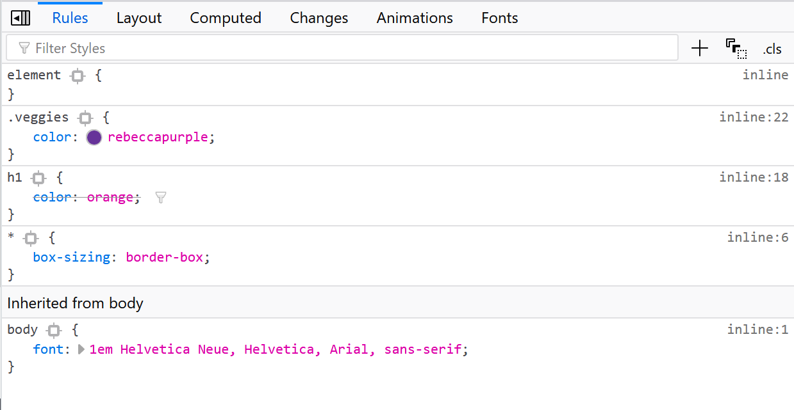
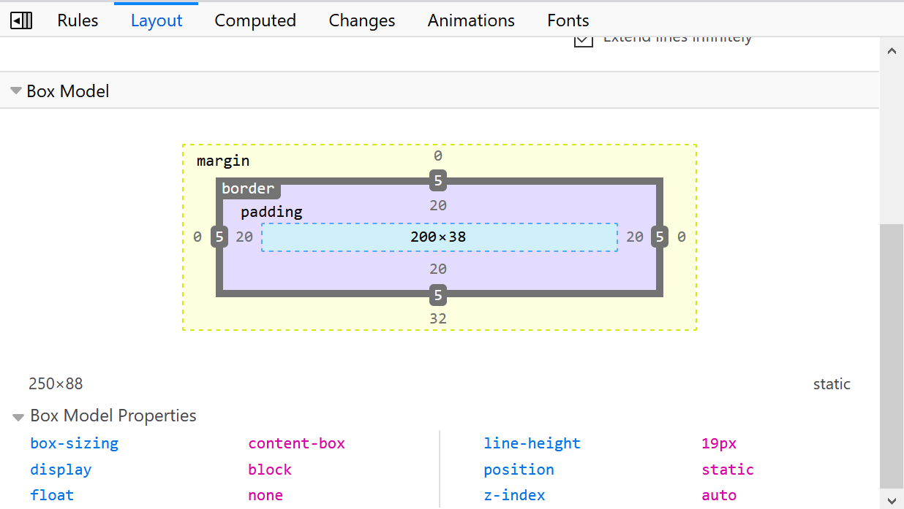

阅读笔记：CSS有一些关键的基础知识，没有理解将难以掌握。花一些时间来理解这些基础知识真的值得，这会节省大量时间，避免我们长期受挫。[How To Learn CSS](https://www.smashingmagazine.com/2019/01/how-to-learn-css/) 指导我们学习CSS的路径。

# 选择器（selectors）

- 元素（element）选择器，设置元素样式，基于文档。
- 伪元素（pseudo-element）选择器，效果是需要通过添加一个实际的元素才能达到的。
```
// 为某个元素的第一行文字使用样式。
::first-line

// 为某个元素中的文字的首字母或第一个字使用样式。
::first-letter

// 在某个元素之前使用样式，常用"content"配合使用。
::before

// 在某个元素之后使用样式，常用清除浮动。
::after

//选中部分使用样式。
::selection
```
- 类（class）选择器，设置类样式，基于文档。
- 伪类（pseudo-class）选择器，功能和class选择器有些类似，因为是基于文档之外的抽象所以叫伪类。  
```
// a:hover 必须被置于 a:link 和 a:visited 之后，才是有效的。
// a:active 必须被置于 a:hover 之后，才是有效的。
a:link|a:visited|a:hover|a:active
```
由于状态是动态变化的，所以一个元素达到一个特定状态时，它可能得到一个伪类的样式；当状态改变时，它又会失去这个样式。
```
// 伪类将应用于拥有键盘输入焦点的元素。
:focus

// 伪类选择元素中的第一个子元素。
:first-child

//伪类表示的是一个元素是它的父元素的唯一一个子元素。
:only-child

//伪类选择某个元素的一个或多个特定的子元素。
:nth-child()

//和:nth-child()类似，它只计算父元素中指定的某种类型的子元素。
:nth-of-type()

//伪类从某个元素的最后一个子元素开始计算来选择特定的元素。
:nth-last-child()

// 伪类将应用于元素带有指定lang的情况。
:lang

// 伪类选择某个元素匹配的根元素，等同于<html>。
:root

//伪类选择除某个元素之外的所有元素。
:not

//伪类选择没有任何内容的元素。
:empty

//该样式只在用户点击了页面中的超链接，并且跳转到target元素后起作用。
:target
```

# 级联与继承（cascade and inheritance）

CSS 是 Cascading Style Sheets 的缩写，这暗示级联（cascade）的概念是很重要的。  

选择器在级联中胜出取决于三个因素（按级别顺序排列，前面的规则战胜后面的规则）：
1. 重要性（Importance）  
特别的语法可以让一条规则总是优先于其他规则：!important 加在属性值的后面即可。  
如果你能避免的话，不要使用它。由于 !important 改变了层叠正常工作的方式，因此调试CSS问题，尤其是在大型样式表中，会变得非常困难。
2. 专用性（Specificity）  
匹配元素越少，专用性的量位级越高。  
直接在 style 属性中声明（千位） > ID选择器（百位） > 类选择器（十位） > 元素选择器（个位）  
累加专用性的量，值最大者胜出。
注意: 通用选择器 (*), 复合选择器 (+, >, ~, ' ') 和否定伪类 (:not) 在专用性中无影响。  
3. 源代码次序（Source order）  
如果多个相互竞争的选择器具有相同的重要性和专用性，后面的规则将战胜先前的规则。

CSS继承大部分符合常识。其思想是，应用于某个元素的一些属性值将由该元素的子元素继承，而有些则不会。
- 对 font-family 和 color 进行继承是有意义的。  
因为这使得您可以很容易地设置一个站点范围的基本字体，方法是应用一个字体到 <html> 元素；然后，您可以在需要的地方覆盖单个元素的字体。如果要在每个元素上分别设置基本字体，那就太麻烦了。
- 让 margin，padding，border 和 background-image 不被继承是有意义的。  
想象一下，如果在容器元素上设置这些属性并让它们由每个子元素继承，那么样式/布局会发生混乱，然后必须在每个单独的元素上取消它们！
- CSS速写属性 all 能够被应用到每一个继承属性，一次性应用所有的继承属性。这里的值可以是继承属性里的任何一个 （inherit, initial, unset, revert）。对于撤销对样式的修改，这是非常方便的一种方式。

DevTools可以看见哪些CSS不适用于元素。



# 盒子模型（box-model）



屏幕上显示的所有内容都有一个盒子框（margin, border, padding）。
- 标准框模型：采用给定元素的宽度，然后将填充和边框添加到该宽度上。这意味着元素占用的空间大于您给出的宽度。
- 备用框模型：使用元素上的给定宽度作为屏幕上可见元素的宽度。任何填充或边框都会从边缘插入框的内容。这对许多布局更有意义。

# 正常文档流（Normal Document Flow）

- 缺省默认布局。
- 内联元素（Inline elements）框在行内一个接着一个排列。
- 块级元素（Block-level elements）框一行接着一行排列。
- 流中的元素被赋予空间，并且空间被流中的其他元素所尊重。
- 如果通过浮动或定位使元素脱离流，则该元素的空间将不再受到其他流元素的尊重，需要自定义来管理。
- 浮动使元素脱离流，后续内容将环绕浮动元素。
- 定位使元素脱离流，内容出现重叠的情况。

# 块格式化上下文（Block FORMATTING CONTEXTS）

注意：最新版本的显示规范会更改值display以显式声明外部和内部值。  
将来你可能会说 `display: block flex` （block外部控制元素与页面上其他元素一起的行为，当前缺省默认；flex内部控制子元素的外观）。
- 弹性盒布局（Flexible Box Layout）是为一维布局设计的方法。  
该元素的子元素将成为弹性框，它们将按照行轴向依次排列。  
要将元素转换为flex布局，请使用display值为的属性flex。
- 网格布局（Grid Layout）是为二维布局设计的方法。  
要将元素转换为grid布局，请使用display值为的属性grid，然后使用grid-template-columns和grid-template-rows属性设置一些列和/或行。  
推荐使用新fr单位，即为网格布局创建的单位。该fr单元是一个flex单元，表示网格容器中可用空间的一部分。  
- 多列布局（Multi-Column Layout）

# 响应式设计（Responsive Design）

- Grid和Flexbox布局方法通常意味着我们可以使用比旧方法更少的媒体查询，因为它们非常灵活，可以响应视口或组件大小的变化，而无需我们更改元素的宽度。  
- 在某些断点处添加媒体查询进行响应式设计，以进一步增强您的设计。

# 字体和排版（Fonts And Typography）

- 可变字体，使单个字体文件具有无限的变化。
- 使用后备Web字体实现变量字体。

# 变形和动画（Transforms And Animation）

区分设置动画方法（按顺序性能降低但功能增强）：CSS，javascript 原生库 WAAPI（Web Animation API），javascript 三方库 WebGL（Web Graphics Library）。

CSS Transitions 在不影响正常文档流的情况下改变作用内容的位置，这是最简单且性能最佳的方法。
- transform-origin  
指定原点的位置，默认值为元素的中心。  
三个值（x轴、y轴、z轴）来指定，其中每个值都表示一个偏移量，缺省值为其对应的初始值。  
- transform  
指定元素变形：矩阵（matrix）、平移（translate）、缩放（scale）、旋转（rotate）、倾斜（skew）。  
这是通过修改CSS视觉格式化模型的坐标空间来实现的。  
```
/* Keyword values */
transform: none;

/* Function values */
transform: matrix(1.0, 2.0, 3.0, 4.0, 5.0, 6.0);
transform: translate(12px, 50%);
transform: translateX(2em);
transform: translateY(3in);
transform: scale(2, 0.5);
transform: scaleX(2);
transform: scaleY(0.5);
transform: rotate(0.5turn);
transform: skew(30deg, 20deg);
transform: skewX(30deg);
transform: skewY(1.07rad);
transform: matrix3d(1.0, 2.0, 3.0, 4.0, 5.0, 6.0, 7.0, 8.0, 9.0, 10.0, 11.0, 12.0, 13.0, 14.0, 15.0, 16.0);
transform: translate3d(12px, 50%, 3em);
transform: translateZ(2px);
transform: scale3d(2.5, 1.2, 0.3);
transform: scaleZ(0.3);
transform: rotate3d(1, 2.0, 3.0, 10deg);
transform: rotateX(10deg);
transform: rotateY(10deg);
transform: rotateZ(10deg);
transform: perspective(17px);

/* Multiple function values */
transform: translateX(10px) rotate(10deg) translateY(5px);

/* Global values */
transform: inherit;
transform: initial;
transform: unset;
```
CSS animations 从一个CSS样式配置转换到另一个CSS样式配置。
1. 动画的设置（animation属性）:  
- animation-delay  
设置延时，即从元素加载完成之后到动画序列开始执行的这段时间。
- animation-direction  
设置动画在每次运行完后是反向运行还是重新回到开始位置重复运行。
- animation-duration  
设置动画一个周期的时长。
- animation-iteration-count  
设置动画重复次数， 可以指定infinite无限次重复动画
- animation-name  
指定由@keyframes描述的关键帧名称。
- animation-play-state  
允许暂停和恢复动画。
- animation-timing-function  
设置动画速度， 即通过建立加速度曲线，设置动画在关键帧之间是如何变化。
- animation-fill-mode  
指定动画执行前后如何为目标元素应用样式。
2. 关键帧。  
- 动画的实际表现通过使用@keyframes建立两个或两个以上关键帧来实现。
- 每一个关键帧都描述了动画元素在给定的时间点上应该如何渲染。  
- from/0% 表示动画的第一时刻，to/100% 表示动画的最终时刻。
- from/0% 或 to/100% 未指定，浏览器使用计算值开始或结束动画。
